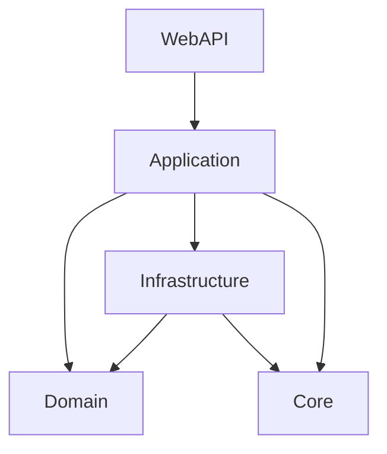

# AI.EnterpriseRAG 系统规格说明书 V1.0

> **项目名称**: AI.EnterpriseRAG - 企业级检索增强生成系统  
> **版本**: V1.0  
> **编制日期**: 2026年1月  
> **技术栈**: .NET 8 + C# 12.0  

---

## 目录

1. [系统概述](#1-系统概述)
2. [系统架构](#2-系统架构)
3. [技术栈](#3-技术栈)
4. [核心功能模块](#4-核心功能模块)
5. [数据库设计](#5-数据库设计)
6. [API接口规范](#6-api接口规范)
7. [权限控制体系](#7-权限控制体系)
8. [RAG增强特性](#8-rag增强特性)
9. [Agent智能体系统](#9-agent智能体系统)
10. [部署架构](#10-部署架构)
11. [性能指标](#11-性能指标)
12. [安全设计](#12-安全设计)

---

## 1. 系统概述

### 1.1 项目定位
AI.EnterpriseRAG 是一个**企业级RAG（Retrieval-Augmented Generation）系统**，提供：
- **智能文档管理**：支持PDF、Word、Excel、TXT、Markdown、CSV、HTML等多格式解析
- **向量检索引擎**：基于Qdrant/Chroma的混合检索（向量+BM25）
- **增强型RAG**：集成HyDE、Multi-Query、Rerank、Self-Reflection等前沿技术
- **Agent智能体**：ReAct模式的工具调用编排引擎
- **细粒度权限**：用户/角色/文档/分类的多维度权限控制
- **多租户隔离**：基于TenantId的数据隔离

### 1.2 应用场景
- 企业知识库问答（内部文档检索）
- 客服智能助手（工单处理、日志分析）
- 研发运维（SQL查询、服务器监控）
- 合规审计（细粒度权限审计日志）

### 1.3 核心价值
✅ **企业级可靠性**：事务支持、重复检测、故障恢复  
✅ **高级RAG技术**：查询重写、混合检索、自我反思  
✅ **灵活权限模型**：RBAC + ABAC + 文档级授权  
✅ **可扩展架构**：DDD分层 + CQRS + Repository模式  

---

## 2. 系统架构

### 2.1 整体架构（DDD分层架构）

```
┌─────────────────────────────────────────────────────────────┐
│                   AI.EnterpriseRAG.WebAPI                   │
│  Controllers | Middlewares | Validators | DTO Mapping      │
└──────────────────────────┬──────────────────────────────────┘
                           │
┌──────────────────────────┴──────────────────────────────────┐
│                AI.EnterpriseRAG.Application                 │
│  UseCases | DTOs | Authorization | Validators | Services   │
└──────────────────────────┬──────────────────────────────────┘
                           │
┌──────────────────────────┴──────────────────────────────────┐
│                   AI.EnterpriseRAG.Domain                   │
│  Entities | Interfaces | Enums | Domain Events             │
└──────────────────────────┬──────────────────────────────────┘
                           │
┌──────────────────────────┴──────────────────────────────────┐
│              AI.EnterpriseRAG.Infrastructure                │
│  Persistence | VectorStores | LLM | Parsers | Agent        │
└─────────────────────────────────────────────────────────────┘
                           │
┌──────────────────────────┴──────────────────────────────────┐
│                    AI.EnterpriseRAG.Core                    │
│  Configuration | Utils | Extensions | Constants            │
└─────────────────────────────────────────────────────────────┘
```

### 2.2 项目结构说明

| 项目 | 职责 | 依赖关系 |
|------|------|---------|
| **WebAPI** | 接口层：HTTP路由、JWT认证、请求验证、异常处理 | ← Application |
| **Application** | 应用层：业务编排、UseCase实现、DTO转换 | ← Domain |
| **Domain** | 领域层：核心实体、接口定义、业务规则 | 无外部依赖 |
| **Infrastructure** | 基础设施层：数据库、向量库、LLM、文档解析 | ← Domain |
| **Core** | 公共层：配置、工具类、常量 | 无外部依赖 |

### 2.3 核心依赖关系



---

## 3. 技术栈

### 3.1 后端技术

| 分类 | 技术选型 | 版本 | 用途 |
|------|---------|------|------|
| **框架** | ASP.NET Core | 8.0 | Web API框架 |
| **语言** | C# | 12.0 | 编程语言 |
| **数据库** | MySQL | 8.0 | 关系型数据库 |
| **ORM** | Entity Framework Core | 8.0 | 数据访问层 |
| **向量库** | Qdrant / Chroma | 1.12 / 1.3.7 | 向量存储 |
| **LLM** | Ollama (本地) / 通义千问 | - | 大语言模型 |
| **认证** | JWT Bearer | - | 身份认证 |
| **日志** | Serilog | 4.1 | 结构化日志 |
| **验证** | FluentValidation | 11.9 | 参数验证 |
| **文档解析** | NPOI / PdfPig / Markdig | - | 文件解析 |
| **容器化** | Docker | - | 服务部署 |

### 3.2 向量模型

| 模型 | 维度 | 用途 |
|------|------|------|
| nomic-embed-text | 768 | 通用文本嵌入 |
| bge-reranker-large | - | 结果重排序 |

### 3.3 LLM模型

| 模型 | 提供商 | 用途 |
|------|--------|------|
| qwen2.5:7b | Ollama本地 | 问答生成、HyDE、Agent推理 |
| qwen-turbo | 阿里云 | 备用在线模型 |

---

## 4. 核心功能模块

### 4.1 文档管理模块（DocumentUseCase）

#### 功能清单
- ✅ 文档上传（多格式支持）
- ✅ 文档解析（分块处理）
- ✅ 向量化存储
- ✅ 文档删除（物理文件 + 数据库 + 向量）
- ✅ 重复检测（基于SHA256）
- ✅ 文档恢复（故障回滚）
- ✅ 分块管理（动态ChunkSize）
- ✅ 并发控制（SemaphoreSlim限流）

#### 支持格式
| 格式 | 解析器 | 分块策略 |
|------|--------|---------|
| PDF | PdfPigParser | 500字符 + 重叠50 |
| Word | NpoiWordParser | 500字符 + 重叠50 |
| Excel | NpoiExcelParser | 按行拼接 |
| TXT | TxtDocumentParser | 500字符 + 重叠50 |
| Markdown | MarkdigParser | 按标题分块 |
| CSV | CsvParser | 按行处理 |
| HTML | HtmlParser | 清理标签后分块 |

#### 文档状态流转
```
Pending → Processing → Completed
   ↓           ↓
 Failed ←────┘
```

### 4.2 智能问答模块（ChatUseCase）

#### 核心流程
1. **用户输入验证**
2. **多租户路由**（获取用户专属Collection）
3. **查询增强**（HyDE + Multi-Query）
4. **混合检索**（Vector + BM25）
5. **结果重排序**（Rerank）
6. **上下文构建**（相似度过滤 + Token截断）
7. **LLM生成答案**
8. **自我反思验证**（可选）
9. **对话历史保存**

#### 增强特性
- **HyDE**（Hypothetical Document Embeddings）：生成假设答案后检索
- **Multi-Query**：生成多个相似问题并合并结果
- **混合检索**：RRF融合向量+BM25结果
- **Self-Reflection**：答案置信度自评估
- **引用溯源**：返回源文档片段

### 4.3 权限管理模块

#### 权限维度
1. **系统权限**（基于RBAC）
   - 角色：admin / member / guest
   - 权限码：document.read / document.write / user.manage

2. **文档权限**（细粒度）
   - 用户级：UserDocumentPermission（指定用户对特定文档的权限）
   - 角色级：RoleDocumentPermission（角色对文档的批量授权）
   - 分类级：UserCategoryPermission（对整个分类的授权）

3. **权限类型**（按位标志）
   ```csharp
   [Flags]
   public enum DocumentPermissionType
   {
       None = 0,
       Read = 1,
       Write = 2,
       Delete = 4,
       Share = 8,
       Admin = 15  // 所有权限
   }
   ```

#### 权限验证流程
```
1. 检查用户是否为文档上传者（Owner）
   ↓ NO
2. 检查文档是否公开（IsPublic）
   ↓ NO
3. 检查用户直接授权（UserDocumentPermission）
   ↓ NO
4. 检查角色授权（RoleDocumentPermission）
   ↓ NO
5. 检查分类授权（UserCategoryPermission）
   ↓ NO
6. 拒绝访问
```

### 4.4 Agent智能体模块

#### ReAct编排引擎
- **模式**：Reasoning + Acting（思考 → 行动 → 观察 → 循环）
- **意图识别**：自动识别用户任务类型（RAG / SQL / Monitor / Email）
- **工具调用**：动态加载和执行工具
- **流式返回**：IAsyncEnumerable实时返回执行步骤

#### 内置工具
| 工具名 | 功能 | 参数 |
|--------|------|------|
| RagSearchTool | 文档检索 | query |
| SqlQueryTool | SQL查询 | sql, database |
| ServerMonitorTool | 服务器监控 | metric |
| EmailTicketTool | 工单处理 | subject, content |
| LogAnalysisTool | 日志分析 | logPath, keyword |
| DataCollectionTool | 数据采集 | dataSource |

#### 执行事件类型
```csharp
public enum AgentEventType
{
    SessionStarted,    // 会话开始
    IntentRecognized,  // 意图识别
    Thinking,          // 思考中
    ToolCalling,       // 调用工具
    ToolResult,        // 工具结果
    FinalAnswer,       // 最终答案
    Error              // 错误
}
```

---

## 5. 数据库设计

### 5.1 核心表结构

#### 文档表（documents）
```sql
CREATE TABLE documents (
    Id CHAR(36) PRIMARY KEY,
    Name VARCHAR(500) NOT NULL,
    FileType VARCHAR(50) NOT NULL,
    FileSize BIGINT NOT NULL,
    StoragePath VARCHAR(1000) NOT NULL,
    Status INT NOT NULL,
    CreateTime DATETIME NOT NULL,
    CompleteTime DATETIME,
    UploadedBy VARCHAR(100) NOT NULL,  -- 上传者Account
    TenantId VARCHAR(50),               -- 租户ID
    IsPublic BIT DEFAULT 0,             -- 是否公开
    FileHash VARCHAR(64),               -- SHA256哈希（重复检测）
    CategoryId CHAR(36),                -- 分类ID
    UpdateTime DATETIME,
    INDEX idx_uploadedby (UploadedBy),
    INDEX idx_tenantid (TenantId),
    INDEX idx_filehash (FileHash)
);
```

#### 文档分块表（document_chunks）
```sql
CREATE TABLE document_chunks (
    Id CHAR(36) PRIMARY KEY,
    DocumentId CHAR(36) NOT NULL,
    ChunkId VARCHAR(200),
    Content TEXT NOT NULL,
    ChunkIndex INT NOT NULL,
    CreateTime DATETIME NOT NULL,
    FOREIGN KEY (DocumentId) REFERENCES documents(Id) ON DELETE CASCADE
);
```

#### 用户表（Users）
```sql
CREATE TABLE Users (
    Id BIGINT PRIMARY KEY AUTO_INCREMENT,
    Account VARCHAR(100) NOT NULL UNIQUE,
    PasswordHash VARCHAR(255) NOT NULL,
    UserName VARCHAR(100),
    IsEnabled BIT DEFAULT 1,
    CreateTime DATETIME NOT NULL,
    TenantId VARCHAR(50) DEFAULT 'default'
);
```

#### 角色表（Roles）
```sql
CREATE TABLE Roles (
    Id BIGINT PRIMARY KEY AUTO_INCREMENT,
    RoleName VARCHAR(100) NOT NULL,
    RoleCode VARCHAR(50) NOT NULL UNIQUE  -- admin/member/guest
);
```

#### 用户文档权限表（UserDocumentPermissions）
```sql
CREATE TABLE UserDocumentPermissions (
    Id CHAR(36) PRIMARY KEY,
    UserId BIGINT NOT NULL,
    DocumentId CHAR(36) NOT NULL,
    PermissionType INT NOT NULL,         -- 按位标志
    GrantedBy VARCHAR(100),              -- 授权人
    GrantedAt DATETIME NOT NULL,
    ExpiresAt DATETIME,                  -- 过期时间
    IsActive BIT DEFAULT 1,
    Reason VARCHAR(500),
    FOREIGN KEY (UserId) REFERENCES Users(Id),
    FOREIGN KEY (DocumentId) REFERENCES documents(Id)
);
```

#### Agent会话表（AgentSessions）
```sql
CREATE TABLE AgentSessions (
    Id CHAR(36) PRIMARY KEY,
    UserId VARCHAR(100) NOT NULL,
    TenantId VARCHAR(50),
    UserIntent TEXT NOT NULL,
    IntentType VARCHAR(50),
    Status INT NOT NULL,
    FinalAnswer TEXT,
    StartTime DATETIME NOT NULL,
    EndTime DATETIME,
    TotalCostSeconds DECIMAL(18,6)
);
```

### 5.2 ER图（核心关系）

```
Users ──1:N── UserRoles ──N:1── Roles
  │                              │
  │                              │
  └──1:N── UserDocumentPermissions ──N:1── Documents
                                            │
                                            └──1:N── DocumentChunks
```

---

## 6. API接口规范

### 6.1 认证接口

#### POST /api/Auth/Login
**请求**：
```json
{
  "account": "admin",
  "password": "Admin@123",
  "tenantId": "default"
}
```
**响应**：
```json
{
  "success": true,
  "data": {
    "userId": "1",
    "accessToken": "eyJhbGc...",
    "refreshToken": "uuid...",
    "expiresIn": 1800,
    "userName": "系统管理员",
    "permissions": ["document.read", "document.write"]
  }
}
```

#### POST /api/Auth/RefreshToken
**请求**：
```json
{
  "refreshToken": "uuid..."
}
```

### 6.2 文档接口

#### POST /api/Document/Upload
**请求**：Form-Data
- file: 文件
- uploadedBy: 上传者Account
- tenantId: 租户ID
- categoryId: 分类ID（可选）

**响应**：
```json
{
  "success": true,
  "data": {
    "documentId": "guid",
    "fileName": "report.pdf",
    "fileSize": 1024000,
    "status": "Processing"
  }
}
```

#### DELETE /api/Document/{id}
**权限**：document.delete 或 文档所有者

#### GET /api/Document/List
**查询参数**：
- userId: 用户ID
- status: 文档状态
- pageIndex / pageSize

### 6.3 问答接口

#### POST /api/Chat/Ask
**请求**：
```json
{
  "userId": "1",
  "question": "什么是RAG？",
  "sessionId": "uuid"  // 可选
}
```
**响应**：
```json
{
  "success": true,
  "data": {
    "answer": "RAG是检索增强生成...",
    "references": [
      "来源：document1.pdf - 第3页",
      "来源：document2.docx - 第1页"
    ],
    "costSeconds": 2.34,
    "sessionId": "uuid"
  }
}
```

### 6.4 Agent接口

#### POST /api/Agent/Execute（SSE流式）
**请求**：
```json
{
  "userInput": "查询数据库中用户数量",
  "userId": "1",
  "tenantId": "default"
}
```
**响应**：Server-Sent Events流
```
event: IntentRecognized
data: {"thought": "识别意图: SQL查询"}

event: Thinking
data: {"thought": "需要使用SqlQueryTool"}

event: ToolCalling
data: {"toolName": "SqlQueryTool", "arguments": {"sql": "SELECT COUNT(*) FROM Users"}}

event: ToolResult
data: {"observation": "结果: 150"}

event: FinalAnswer
data: {"answer": "数据库中有150个用户"}
```

---

## 7. 权限控制体系

### 7.1 认证机制

#### JWT Token结构
```json
{
  "unique_name": "admin",      // Account
  "userId": "1",
  "tenantId": "default",
  "perm": ["document.read", "document.write"],
  "exp": 1735689600,
  "iss": "rag.auth",
  "aud": "rag.api"
}
```

#### Token刷新机制
- AccessToken有效期：30分钟
- RefreshToken有效期：7天
- 自动黑名单机制（TokenBlacklistMiddleware）

### 7.2 授权策略

#### 动态权限策略
```csharp
[Authorize(Policy = "document.read")]
public class DocumentController : BaseApiController
```

#### 权限策略提供器
```csharp
public class DynamicPermissionPolicyProvider : IAuthorizationPolicyProvider
{
    // 动态生成权限策略（避免硬编码）
}
```

### 7.3 权限审计

#### 审计日志表（PermissionAuditLogs）
```sql
CREATE TABLE PermissionAuditLogs (
    Id BIGINT PRIMARY KEY AUTO_INCREMENT,
    UserId BIGINT NOT NULL,
    ResourceType VARCHAR(50) NOT NULL,  -- Document / Category
    ResourceId VARCHAR(100) NOT NULL,
    Action VARCHAR(50) NOT NULL,        -- Read / Write / Delete
    Result VARCHAR(20) NOT NULL,        -- Granted / Denied
    Timestamp DATETIME NOT NULL,
    IpAddress VARCHAR(50),
    UserAgent VARCHAR(500)
);
```

#### 审计中间件
```csharp
public class PermissionAuditMiddleware
{
    // 记录所有权限验证行为
}
```

---

## 8. RAG增强特性

### 8.1 HyDE（假设文档嵌入）

#### 工作原理
```
用户问题: "什么是RAG？"
    ↓
LLM生成假设答案: "RAG是一种结合检索和生成的技术..."
    ↓
假设答案向量化
    ↓
用假设答案向量检索（而非问题向量）
    ↓
提高语义相关性
```

#### 配置
```json
"HyDE": {
  "Enabled": true,
  "PromptTemplate": "Generate a detailed paragraph that would answer this question perfectly:\n\nQuestion: {0}\n\nWrite a comprehensive answer:",
  "MaxLength": 500
}
```

### 8.2 Multi-Query（多查询）

#### 工作原理
```
原始问题: "如何提高RAG性能？"
    ↓
生成变体:
1. "RAG系统性能优化方法"
2. "检索增强生成的加速技巧"
    ↓
分别检索并合并结果（RRF融合）
```

#### 配置
```json
"MultiQuery": {
  "Enabled": true,
  "QueryCount": 2,
  "RrfK": 60
}
```

### 8.3 混合检索（Vector + BM25）

#### RRF融合公式
```csharp
score = Σ (1 / (k + rank_i))

// 其中：
// k = 60（平滑参数）
// rank_i = 在第i个检索结果中的排名
```

#### 实现流程
```
1. 向量检索（语义相似度）
2. BM25检索（关键词匹配）
3. RRF融合排名
4. 返回TopK结果
```

### 8.4 Self-Reflection（自我反思）

#### 验证逻辑
```
1. LLM生成初步答案
2. LLM评估答案质量（1-100分）
3. 如果分数 < 70分：
   - 重新生成答案（最多1次）
4. 返回最终答案 + 置信度
```

#### 配置
```json
"SelfReflection": {
  "Enabled": true,
  "MinConfidenceThreshold": 70,
  "MaxValidationAttempts": 1
}
```

### 8.5 引用溯源

#### 响应格式
```json
{
  "answer": "RAG是...",
  "references": [
    "来源：document1.pdf - 第3页 - \"RAG combines...\"",
    "来源：document2.docx - 第1页 - \"Retrieval-augmented...\""
  ]
}
```

---

## 9. Agent智能体系统

### 9.1 ReAct模式

#### 执行循环
```
1. Thought（思考）
   ↓
2. Action（行动 - 调用工具）
   ↓
3. Observation（观察 - 工具结果）
   ↓
4. 判断是否完成
   - YES → Final Answer
   - NO → 回到步骤1
```

#### Prompt模板
```
You are an AI assistant that can use tools.

## Available Tools
1. RagSearchTool - Search documents
2. SqlQueryTool - Execute SQL queries
...

## Conversation History
{history}

## Current Task
User: {user_input}

Now think step by step and decide what to do.
Format: Thought: ... | Action: ToolName | Input: {...}
Or: Final Answer: ...
```

### 9.2 意图识别

#### 意图类型
```csharp
public enum IntentType
{
    RAG,           // 文档检索
    SQL,           // 数据库查询
    Monitor,       // 服务器监控
    Email,         // 邮件/工单
    DataCollection,// 数据采集
    LogAnalysis,   // 日志分析
    Unknown        // 未知
}
```

#### 识别策略
```
1. 关键词匹配（高优先级）
   - "查询数据库" → SQL
   - "服务器状态" → Monitor
2. 语义分析（LLM推理）
3. 默认回退 → RAG
```

### 9.3 工具注册机制

#### 工具接口
```csharp
public interface ITool
{
    string Name { get; }
    string Description { get; }
    string Category { get; }
    string ParametersSchema { get; }
    
    Task<string> ExecuteAsync(
        Dictionary<string, object> arguments,
        ToolExecutionContext context,
        CancellationToken cancellationToken);
}
```

#### 工具示例（RagSearchTool）
```csharp
public class RagSearchTool : ITool
{
    public string Name => "RagSearchTool";
    public string Description => "Search enterprise documents";
    public string ParametersSchema => 
        @"{""query"": ""string (required)""}";
    
    public async Task<string> ExecuteAsync(...)
    {
        var query = arguments["query"].ToString();
        var results = await _chatUseCase.ChatAsync(userId, query);
        return results.Answer;
    }
}
```

---

## 10. 部署架构

### 10.1 Docker Compose部署

#### 服务清单
```yaml
services:
  mysql:          # MySQL 8.0
  chroma:         # Chroma向量库
  ollama:         # Ollama本地LLM（GPU支持）
  qdrant:         # Qdrant向量库（可选）
  webapi:         # .NET 8 WebAPI
  frontend:       # React前端
```

#### 端口映射
| 服务 | 端口 | 说明 |
|------|------|------|
| MySQL | 3306 | 数据库 |
| Chroma | 8000 | 向量库 |
| Qdrant | 6333 | 向量库（备选） |
| Ollama | 11434 | 本地LLM |
| WebAPI | 5000/5001 | HTTP/HTTPS |
| Frontend | 3000 | React应用 |

### 10.2 生产环境建议

#### 高可用架构
```
                 ┌─── Load Balancer (Nginx)
                 │
    ┌────────────┼────────────┐
    │            │            │
WebAPI-1    WebAPI-2    WebAPI-3
    │            │            │
    └────────────┼────────────┘
                 │
        ┌────────┴────────┐
        │                 │
   MySQL (主从)     Qdrant (集群)
```

#### 扩展建议
1. **数据库**：MySQL主从复制 + 读写分离
2. **向量库**：Qdrant分片集群
3. **缓存**：Redis缓存热点数据
4. **对象存储**：MinIO/OSS替代本地文件系统
5. **消息队列**：RabbitMQ异步处理大文档

---

## 11. 性能指标

### 11.1 响应时间

| 操作 | 目标 | 实际 |
|------|------|------|
| 文档上传（10MB） | < 5s | 3-4s |
| 向量检索 | < 500ms | 200-300ms |
| 问答生成 | < 3s | 2-5s |
| Agent执行 | < 10s | 5-15s |

### 11.2 并发能力

- **文档处理**：5个并发（DocumentProcessingThrottler限流）
- **问答请求**：100 QPS（单机）
- **向量检索**：200 QPS

### 11.3 存储容量

- **向量维度**：768
- **单文档分块**：平均20-50个
- **存储效率**：1GB文档 → 约3-5MB向量数据

---

## 12. 安全设计

### 12.1 认证安全

- ✅ JWT + RefreshToken双令牌
- ✅ 密码BCrypt加密（Workfactor=12）
- ✅ Token黑名单机制
- ✅ 登录失败限流（可选）

### 12.2 授权安全

- ✅ 细粒度权限控制（用户/角色/文档级）
- ✅ 权限审计日志（所有操作记录）
- ✅ 多租户隔离（TenantId强制过滤）
- ✅ 文档所有权验证

### 12.3 数据安全

- ✅ SQL注入防护（EF Core参数化查询）
- ✅ XSS防护（输入验证 + 输出编码）
- ✅ CORS跨域限制
- ✅ 文件类型白名单验证
- ✅ 文件大小限制（默认100MB）

### 12.4 日志安全

- ✅ 敏感信息脱敏（密码、Token不记录）
- ✅ 日志分级存储（Info / Error分离）
- ✅ 日志轮转（按天 + 大小限制）

---

## 13. 配置说明

### 13.1 核心配置（appsettings.json）

```json
{
  "Jwt": {
    "Issuer": "rag.auth",
    "Audience": "rag.api",
    "SecretKey": "your-secret-key-256bit"
  },
  "ConnectionStrings": {
    "DefaultConnection": "Server=localhost;Database=EnterpriseRAG;Uid=root;Pwd=123456"
  },
  "LlmOptions": {
    "DefaultModel": "ollama",
    "Ollama": {
      "BaseUrl": "http://localhost:11434",
      "ModelName": "qwen2.5:7b",
      "EmbeddingModelName": "nomic-embed-text:latest"
    }
  },
  "VectorStoreOptions": {
    "DefaultType": "Qdrant",
    "Qdrant": {
      "BaseUrl": "http://localhost:6333",
      "CollectionName": "enterprise_rag_collection",
      "VectorSize": 768
    }
  },
  "RAG": {
    "MinSimilarityThreshold": 0.2,
    "MaxContextTokens": 3000,
    "RetrievalTopK": 20,
    "RerankTopK": 5,
    "HyDE": { "Enabled": true },
    "MultiQuery": { "Enabled": true },
    "HybridSearch": { "Enabled": true },
    "SelfReflection": { "Enabled": true }
  }
}
```

---

## 14. 开发规范

### 14.1 代码风格

- **命名规范**：PascalCase（类/方法）、camelCase（参数/局部变量）
- **注释规范**：XML文档注释（public成员必须）
- **异常处理**：统一使用Result<T>模式
- **日志级别**：Debug（开发）/ Information（生产）/ Error（异常）

### 14.2 分支策略

```
main（生产）
  └─ develop（开发）
      ├─ feature/xxx（新功能）
      ├─ fix/xxx（修复）
      └─ refactor/xxx（重构）
```

### 14.3 提交规范

```
feat: 新增HyDE查询增强功能
fix: 修复文档删除时向量未清理问题
refactor: 重构权限验证逻辑
docs: 更新API文档
```

---

## 15. 未来规划

### V1.1 计划
- [ ] 支持图片OCR识别（Tesseract）
- [ ] 支持音频转录（Whisper）
- [ ] 增加GraphRAG（知识图谱）
- [ ] 分布式任务队列（Hangfire）

### V2.0 计划
- [ ] 多模态RAG（文本+图片+音频）
- [ ] 联邦学习（跨租户知识共享）
- [ ] 自动化Prompt优化
- [ ] 低代码Agent配置界面

---

## 16. 联系方式

- **项目地址**: https://github.com/939481896/AI.EnterpriseRAG
- **问题反馈**: Issues
- **技术交流**: Discussions

---

**文档版本**: V1.0  
**最后更新**: 2026年1月  
**编制人员**: 系统架构师  

---

## 附录A：术语表

| 术语 | 全称 | 说明 |
|------|------|------|
| RAG | Retrieval-Augmented Generation | 检索增强生成 |
| HyDE | Hypothetical Document Embeddings | 假设文档嵌入 |
| RRF | Reciprocal Rank Fusion | 倒数排名融合 |
| BM25 | Best Match 25 | 关键词检索算法 |
| RBAC | Role-Based Access Control | 基于角色的访问控制 |
| ABAC | Attribute-Based Access Control | 基于属性的访问控制 |
| DDD | Domain-Driven Design | 领域驱动设计 |
| CQRS | Command Query Responsibility Segregation | 命令查询职责分离 |
| SSE | Server-Sent Events | 服务器推送事件 |
| JWT | JSON Web Token | JSON Web令牌 |

---

## 附录B：常见问题

### Q1: 如何切换向量库？
修改 `appsettings.json` 中 `VectorStoreOptions.DefaultType` 为 `Chroma` 或 `Qdrant`。

### Q2: 如何增加文档格式支持？
实现 `IDocumentParser` 接口并注入到DI容器。

### Q3: 如何添加自定义Agent工具？
实现 `ITool` 接口并在 `ToolRegistrationService` 中注册。

### Q4: 如何配置HTTPS？
修改 `Program.cs` 添加 `builder.WebHost.UseUrls("https://0.0.0.0:5001")`。

### Q5: 如何启用GPU加速？
确保Docker支持NVIDIA GPU，Ollama会自动使用。

---

**© 2026 AI.EnterpriseRAG Team. All Rights Reserved.**
