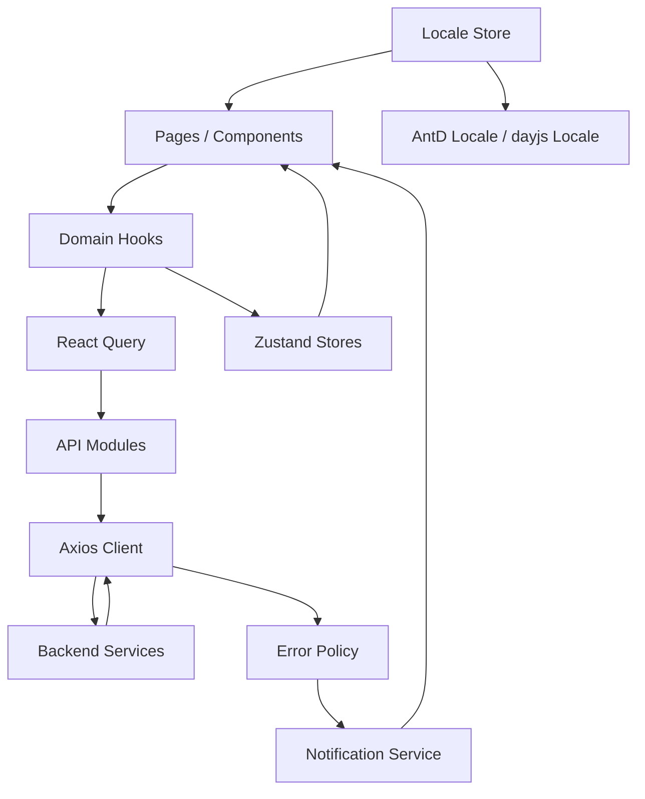
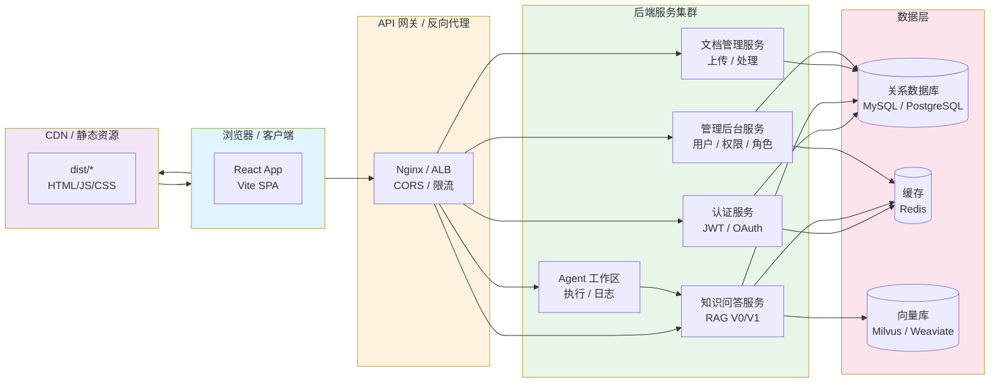
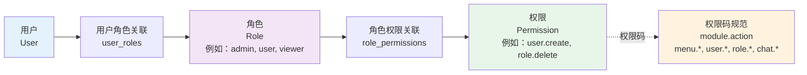
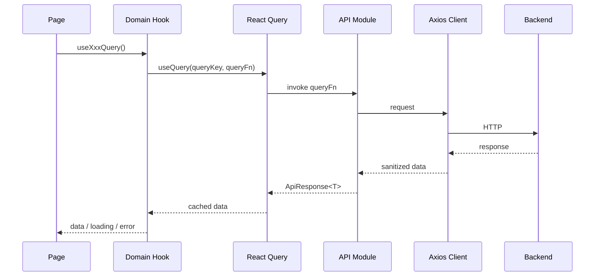
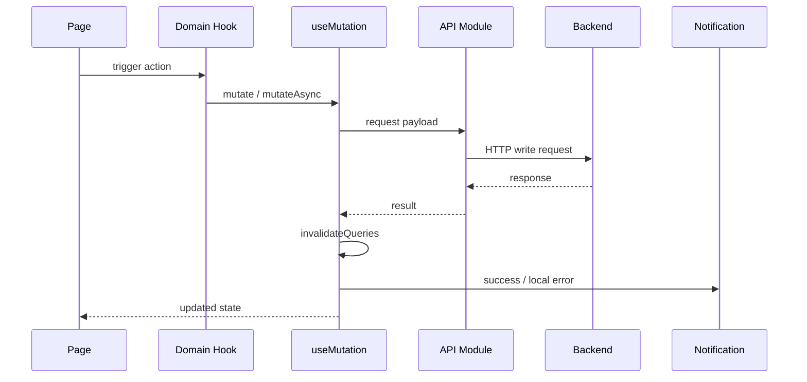

# AI.EnterpriseRAG Frontend

企业级 RAG 智能问答系统前端工程。该项目面向中后台管理、知识问答、文档管理、Agent 工作区等场景，强调可维护性、可扩展性、权限治理、统一错误处理和前后端契约一致性。

## 项目定位

- 面向企业内部知识问答与管理后台的一体化前端
- 支持 RBAC 权限治理、会话管理、文档管理、Agent 执行展示
- 采用 React + TypeScript + React Query + Zustand + Ant Design 的分层架构
- 以“长期维护”和“模块复制扩展”为目标，而不是一次性页面堆砌

## 技术栈

### 核心框架

- React 18
- TypeScript 5
- Vite 5
- React Router 6

### UI 与交互

- Ant Design 5
- @ant-design/icons
- dayjs
- react-markdown
- remark-gfm
- echarts
- echarts-for-react

### 数据与状态

- @tanstack/react-query
- Zustand
- Axios

### 安全与工程化

- DOMPurify
- ESLint
- Prettier
- Husky
- lint-staged
- Vitest

## 为什么选择这些技术

### React 18

- 生态成熟，适合企业级长期维护
- 组件化能力强，便于页面与业务模块拆分
- 与 React Query、Ant Design、Router 的配合成熟稳定

### TypeScript

- 明确接口契约，降低前后端联调成本
- 对 RBAC、API 响应、Query Key、表单模型等复杂结构更友好
- 适合多人协作和中长期演进

### Vite

- 本地启动快，开发体验明显优于传统打包方案
- 原生支持现代 ESM，构建配置清晰
- 便于做 chunk 拆分、懒加载与性能优化

### Ant Design

- 企业中后台组件完善，表格、表单、抽屉、树、弹窗等场景覆盖高
- 可快速形成一致的视觉与交互规范
- 降低重复造轮子的成本

### React Query

- 很适合管理服务端状态
- 内建缓存、失效、重试、后台刷新等能力
- 比把所有远程数据塞进本地 store 更清晰，也更易维护

### Zustand

- 适合轻量客户端状态，例如登录态、当前会话、语言选择
- API 简洁，心智负担低
- 和 React Query 的职责边界清晰，避免状态层混乱

### Axios

- 拦截器机制成熟，方便统一注入 Token、处理 401、清洗错误
- 适合企业项目统一 API 客户端封装

### DOMPurify

- 用于后端返回文本和错误信息的清洗，降低 XSS 风险
- 对聊天回答、异常信息等富文本相关场景很有必要

## 系统架构概览

### 应用层架构



### 部署拓扑



**部署说明**：

- **前端部署**：通过 CDN 分发 SPA 资源，支持多地域加速
- **API 网关**：负责 CORS、限流、SSL 终止、请求路由
- **后端服务**：微服务架构，各模块独立扩展
- **数据层**：关系数据 + 向量数据分离，支持高并发查询

## 架构分层

### 1. 页面层

页面层负责页面编排、布局组合和交互组织，不直接承载复杂数据逻辑。

代表目录：

- `src/pages/Auth`
- `src/pages/Chat`
- `src/pages/Document`
- `src/pages/Agent`
- `src/pages/Admin`

### 2. 组件层

组件层负责可复用 UI 单元，例如聊天消息、会话侧边栏、布局、全局错误边界。

代表目录：

- `src/components/Chat`
- `src/components/Layout`
- `src/components/ErrorBoundary`

### 3. Hooks 层

Hooks 层封装业务能力，连接页面层和数据层。典型职责包括请求封装、缓存失效、局部通知、乐观更新。

代表文件：

- `src/hooks/useAuth.ts`
- `src/hooks/useChat.ts`
- `src/hooks/useDocument.ts`
- `src/hooks/usePermission.ts`

### 4. 状态层

状态层只保留客户端本地状态，不与服务端状态职责重叠。

代表文件：

- `src/store/authStore.ts`
- `src/store/chatStore.ts`
- `src/store/localeStore.ts`

### 5. API 层

API 层封装后端调用入口，统一依赖 `apiClient`，避免页面散落 HTTP 实现。

代表目录：

- `src/api/auth.ts`
- `src/api/chat.ts`
- `src/api/document.ts`
- `src/api/permission.ts`
- `src/api/user.ts`
- `src/api/agent.ts`

### 6. 基础设施层

基础设施层提供全局能力，包括 QueryClient、错误处理、通知、环境变量、文案中心、Query Key 注册表。

代表文件：

- `src/main.tsx`
- `src/api/client.ts`
- `src/config/errorPolicy.ts`
- `src/services/notification.ts`
- `src/config/queryKeys.ts`
- `src/config/uiText.ts`

## 目录结构

```text
frontend/
├── src/
│   ├── api/                    # 后端接口封装
│   ├── components/             # 可复用 UI 组件
│   ├── config/                 # 文案、错误策略、Query Key 等配置中心
│   ├── contexts/               # 上下文，如权限上下文
│   ├── hooks/                  # 业务 Hook
│   ├── pages/                  # 页面级模块
│   ├── services/               # 横切服务，如通知服务
│   ├── store/                  # Zustand 客户端状态
│   ├── styles/                 # 全局样式与变量
│   ├── types/                  # 类型定义与环境变量定义
│   ├── App.tsx                 # 路由与页面懒加载入口
│   └── main.tsx                # 应用启动与全局 Provider
├── package.json
├── tsconfig.json
├── vite.config.ts
└── README.md
```

## 核心模块

### 1. 认证与登录态

- JWT 登录
- Token 基础格式校验
- Token 过期提前校验
- 路由保护
- 401 自动回登录页

关键实现：

- `src/store/authStore.ts`
- `src/hooks/useAuth.ts`
- `src/api/auth.ts`
- `src/App.tsx`

### 2. 智能问答

- 支持 RAG V0 / V1 问答模式
- 会话列表与会话消息分离管理
- Markdown 渲染
- 引用来源展示
- 会话标题编辑、会话删除

关键实现：

- `src/pages/Chat/ChatPage.tsx`
- `src/components/Chat/ChatMessage.tsx`
- `src/components/Chat/SessionSidebar.tsx`
- `src/hooks/useChat.ts`

### 3. 文档管理

- 文档列表
- 文档上传
- 文档删除
- 文档状态管理

关键实现：

- `src/pages/Document/DocumentPage.tsx`
- `src/hooks/useDocument.ts`
- `src/api/document.ts`

### 4. Agent 工作区

- 展示 Agent 意图识别
- 展示工具执行过程
- 展示步骤流与最终输出

关键实现：

- `src/pages/Agent/AgentWorkspace.tsx`
- `src/api/agent.ts`

### 5. 管理后台

- 数据面板
- 用户管理
- 角色管理
- 权限管理
- RBAC 调试页

关键实现：

- `src/pages/Admin/Dashboard.tsx`
- `src/pages/Admin/UserManagement.tsx`
- `src/pages/Admin/RoleManagement.tsx`
- `src/pages/Admin/PermissionManagement.tsx`
- `src/pages/Admin/RBACDebug.tsx`

### 6. 多语言

- 支持中文 / 英文切换
- UI 文案集中管理
- Ant Design 语言包联动
- dayjs 语言联动
- 登录前和登录后都可切换语言

关键实现：

- `src/config/uiText.ts`
- `src/store/localeStore.ts`
- `src/main.tsx`
- `src/components/Layout/AppLayout.tsx`

## 权限与访问控制

### 权限模型

系统采用 **RBAC（Role-Based Access Control）** 权限模型：



### 权限码规范

权限码遵循 `module.action` 格式：

| 模块 | 权限码示例 | 说明 |
| --- | --- | --- |
| 菜单 | `menu.chat`, `menu.admin` | 控制侧边栏菜单显示 |
| 用户 | `user.create`, `user.update`, `user.delete` | 用户管理操作 |
| 角色 | `role.create`, `role.update`, `role.delete` | 角色管理操作 |
| 权限 | `permission.create`, `permission.update`, `permission.delete` | 权限管理操作 |
| 聊天 | `chat.send`, `chat.delete_session` | 聊天操作 |
| 文档 | `document.upload`, `document.delete` | 文档操作 |

### 权限检查示例

**在页面中使用权限守卫**：

```typescript
import { PermissionGuard } from '@/contexts/PermissionContext'

// 单个权限检查
<PermissionGuard permission="user.delete">
  <Button danger onClick={() => deleteUser(id)}>
    删除
  </Button>
</PermissionGuard>

// 多个权限（任一即可）
<PermissionGuard anyPermissions={['role.update', 'role.delete']}>
  <Dropdown menu={{ items: roleActions }} />
</PermissionGuard>

// 多个权限（全部需要）
<PermissionGuard allPermissions={['user.create', 'user.update']}>
  <Button type="primary">批量编辑</Button>
</PermissionGuard>
```

**在 Hooks 中检查权限**：

```typescript
import { usePermissionContext } from '@/contexts/PermissionContext'

const MyComponent = () => {
  const { hasPermission, hasAnyPermission } = usePermissionContext()

  return (
    <div>
      {hasPermission('user.delete') && (
        <Button>删除用户</Button>
      )}
      
      {hasAnyPermission(['admin.view', 'user.view']) && (
        <AdminPanel />
      )}
    </div>
  )
}
```

## 数据流设计

### 读操作数据流



### 写操作数据流



## 页面工作流

### 登录工作流

1. 用户在登录页提交账号、密码、租户。
2. `useLogin` 调用 `authApi.login`。
3. 登录成功后写入 token 与用户信息。
4. `authStore` 对 token 做格式与过期校验。
5. `ProtectedRoute` 校验登录态后进入系统。
6. 登录后空闲时间预加载业务页面 chunk，减少首次点击闪烁。

### 聊天工作流

1. 用户输入问题。
2. `useSendMessage` 先乐观插入用户消息。
3. 如果当前没有会话，先创建会话。
4. 调用 V0 或 V1 聊天接口。
5. 收到回答后插入 AI 消息。
6. 失效会话缓存并刷新当前会话消息。

### 权限工作流

1. 登录成功后获取当前用户权限。
2. `PermissionProvider` 将权限代码映射为上下文。
3. 菜单、按钮、页面局部区域通过 `PermissionGuard` 控制显示。
4. 用户、角色、权限修改后，通过 Query 失效机制自动刷新相关页面。

## 状态管理策略

### React Query 管理什么

- 会话列表
- 会话消息
- 文档列表
- 角色列表
- 权限列表
- 用户角色与用户权限
- 用户列表等服务端数据

### Zustand 管理什么

- 登录态与本地持久化 Token
- 当前会话 ID、聊天消息镜像、流式状态
- 当前语言设置

### 这样拆分的原因

- 服务端状态需要缓存、失效、重试、后台同步，React Query 更适合
- 客户端状态更轻，更偏 UI 会话上下文，Zustand 成本更低
- 避免“远程数据 + UI 状态”混在一个 store 里，降低维护复杂度

## 错误处理架构

### 全局错误通道

- React 运行时异常：`GlobalErrorBoundary`
- 浏览器级异常：`GlobalErrorListeners`
- Query 全局异常：`QueryCache.onError`
- Mutation 全局异常：`MutationCache.onError`

### 错误处理规则

- Axios 拦截器不直接弹所有错误，避免重复通知
- 401 在受保护页面统一清理登录态并跳回登录页
- `errorPolicy` 负责把 HTTP 状态码 / 后端错误码映射为用户可读消息
- `notification` 负责统一消息展示
- `silentError` 用于局部处理场景，避免全局和局部重复弹窗

关键实现：

- `src/api/client.ts`
- `src/config/errorPolicy.ts`
- `src/services/notification.ts`
- `src/main.tsx`

## 安全设计

- 使用 DOMPurify 清洗后端返回文本和错误信息
- 请求自动注入 JWT
- Token 做基础格式校验与过期判断
- 生产模式避免输出完整敏感错误响应
- 统一 API 客户端，减少不受控请求路径

## 性能设计

- 路由级懒加载
- 受保护页面在登录后空闲时预加载
- React Query 缓存与失效控制
- Vite `manualChunks` 按 React / AntD / Query / ECharts / Markdown / Utils 拆包
- 首次路由切换使用内容区 fallback，减少整屏闪烁

关键实现：

- `src/App.tsx`
- `vite.config.ts`

## 功能模块清单

| 模块 | 状态 | 说明 |
| --- | --- | --- |
| 登录 / 注册 | 已完成 | JWT 登录、注册、退出、登录态校验 |
| 智能问答 | 已完成 | RAG V0 / V1、Markdown、引用、会话管理 |
| 文档管理 | 已完成 | 上传、删除、列表与状态展示 |
| Agent 工作区 | 已完成 | Agent 执行过程与结果展示 |
| 管理后台 | 已完成 | 用户、角色、权限、数据面板 |
| 多语言 | 已完成基础能力 | 已支持中英文切换，部分演示文案仍可继续收口 |
| 模板化复用 | 已完成第一阶段 | CRUD 模块模板已具备，非 CRUD 模块模板可继续补充 |

## 环境变量

支持以下环境变量：

```env
VITE_API_BASE_URL=http://localhost:5243
VITE_API_URL=http://localhost:5243
VITE_API_TIMEOUT=300000
```

说明：

- `VITE_API_BASE_URL` 优先级高于 `VITE_API_URL`
- 未设置时默认回退到 `http://localhost:5243`
- 默认请求超时为 300000ms

## 本地开发

### 安装依赖

```bash
npm install
```

### 启动开发环境

```bash
npm run dev
```

默认开发地址：

- Frontend: `http://localhost:3000`
- `/api` 代理到: `http://localhost:5243`

### 类型检查

```bash
npm run type-check
```

### 代码检查

```bash
npm run lint
```

### 自动修复 lint

```bash
npm run lint:fix
```

### 格式化

```bash
npm run format
```

### 构建生产版本

```bash
npm run build
```

### 预览构建结果

```bash
npm run preview
```

## 脚本说明

| 命令 | 作用 |
| --- | --- |
| `npm run dev` | 启动 Vite 开发服务器 |
| `npm run build` | TypeScript 编译并构建产物 |
| `npm run preview` | 本地预览打包结果 |
| `npm run lint` | 执行 ESLint 检查 |
| `npm run lint:fix` | 自动修复 ESLint 问题 |
| `npm run format` | 使用 Prettier 格式化代码 |
| `npm run format:check` | 检查格式是否符合规范 |
| `npm run type-check` | 执行 TypeScript 类型检查 |

## 可维护性设计

该项目在以下方面具备较强可维护性：

- 目录分层清晰，API / hooks / store / pages / config 职责分离
- Query Key 集中注册，降低缓存失效错误率
- 错误策略统一，减少分散处理
- UI 文案集中管理，方便多语言和后续治理
- 权限治理与页面控制解耦，避免页面散落权限判断
- CRUD 模块模板化，便于复制扩展

## 可扩展性设计

该项目适合继续扩展新业务模块，尤其是中后台 CRUD 类页面。新增模块的推荐路径：

1. 在 `src/api` 新增模块 API。
2. 在 `src/hooks` 新增模块业务 Hook。
3. 在 `src/config/queryKeys.ts` 注册查询键。
4. 在 `src/pages` 新增页面或复用 CRUD 模板。
5. 在 `src/config/uiText.ts` 增加文案。
6. 如涉及权限，在权限中心与菜单中补充权限码。

### 模块扩展完整示例

#### 场景：新增「部门管理」模块

##### 第 1 步：定义 API（`src/api/department.ts`）

```typescript
import apiClient from './client'
import type { ApiResponse } from '@/types/api'

export interface Department {
  id: number
  name: string
  code: string
  parentId?: number
  description?: string
  createdAt: string
}

export const departmentApi = {
  // 获取部门列表
  getDepartments: async (page?: number, pageSize?: number) => {
    const { data } = await apiClient.get<ApiResponse<Department[]>>('/api/departments', {
      params: { page, pageSize },
    })
    return data
  },

  // 获取部门树（用于选择父部门）
  getDepartmentTree: async () => {
    const { data } = await apiClient.get<ApiResponse<Department[]>>('/api/departments/tree')
    return data
  },

  // 创建部门
  createDepartment: async (payload: Omit<Department, 'id' | 'createdAt'>) => {
    const { data } = await apiClient.post<ApiResponse<Department>>('/api/departments', payload)
    return data
  },

  // 更新部门
  updateDepartment: async (id: number, payload: Partial<Department>) => {
    const { data } = await apiClient.put<ApiResponse<Department>>(`/api/departments/${id}`, payload)
    return data
  },

  // 删除部门
  deleteDepartment: async (id: number) => {
    const { data } = await apiClient.delete<ApiResponse<null>>(`/api/departments/${id}`)
    return data
  },
}
```

##### 第 2 步：定义 Hooks（`src/hooks/useDepartment.ts`）

```typescript
import { useQuery, useMutation, useQueryClient } from '@tanstack/react-query'
import { departmentApi } from '@/api/department'
import { notification } from '@/services/notification'
import { uiText } from '@/config/uiText'
import { queryKeys } from '@/config/queryKeys'

// 获取部门列表
export function useDepartments(page?: number, pageSize?: number) {
  return useQuery({
    queryKey: queryKeys.department.list(page, pageSize),
    queryFn: () => departmentApi.getDepartments(page, pageSize),
    staleTime: 5 * 60 * 1000,
    gcTime: 30 * 60 * 1000,
  })
}

// 获取部门树（用于级联选择）
export function useDepartmentTree() {
  return useQuery({
    queryKey: queryKeys.department.tree,
    queryFn: () => departmentApi.getDepartmentTree(),
    staleTime: 10 * 60 * 1000,
    gcTime: 60 * 60 * 1000,
  })
}

// 创建部门
export function useCreateDepartment() {
  const queryClient = useQueryClient()
  return useMutation({
    meta: { silentError: true },
    mutationFn: departmentApi.createDepartment,
    onSuccess: () => {
      queryClient.invalidateQueries({ queryKey: queryKeys.department.all })
      notification.success(uiText.feedback.departmentCreateSuccess)
    },
    onError: () => {
      notification.error(uiText.feedback.createFailed)
    },
  })
}

// 更新部门
export function useUpdateDepartment() {
  const queryClient = useQueryClient()
  return useMutation({
    meta: { silentError: true },
    mutationFn: ({ id, payload }: { id: number; payload: any }) =>
      departmentApi.updateDepartment(id, payload),
    onSuccess: () => {
      queryClient.invalidateQueries({ queryKey: queryKeys.department.all })
      notification.success(uiText.feedback.departmentUpdateSuccess)
    },
    onError: () => {
      notification.error(uiText.feedback.updateFailed)
    },
  })
}

// 删除部门
export function useDeleteDepartment() {
  const queryClient = useQueryClient()
  return useMutation({
    meta: { silentError: true },
    mutationFn: departmentApi.deleteDepartment,
    onSuccess: () => {
      queryClient.invalidateQueries({ queryKey: queryKeys.department.all })
      notification.success(uiText.feedback.departmentDeleteSuccess)
    },
    onError: () => {
      notification.error(uiText.feedback.deleteFailed)
    },
  })
}
```

##### 第 3 步：注册 Query Key（`src/config/queryKeys.ts`）

```typescript
export const queryKeys = {
  // ... 其他 key
  
  // 部门管理
  department: {
    all: ['departments'] as const,
    list: (page?: number, pageSize?: number) => 
      ['departments', 'list', page, pageSize] as const,
    tree: ['departments', 'tree'] as const,
  },
}
```

##### 第 4 步：新增文案（`src/config/uiText.ts`）

```typescript
const zhText = {
  // ... 其他文案
  
  adminDepartment: {
    title: '部门管理',
    create: '新建部门',
    edit: '编辑部门',
    delete: '删除部门',
    name: '部门名称',
    code: '部门编码',
    parent: '上级部门',
    description: '描述',
    deleteConfirm: '确定删除部门 "{name}" 吗？',
    inputName: '请输入部门名称',
    inputCode: '请输入部门编码',
  },
}

const enText: DeepPartial<UiTextSchema> = {
  // ... 其他文案
  
  adminDepartment: {
    title: 'Department Management',
    create: 'New Department',
    edit: 'Edit Department',
    delete: 'Delete Department',
    name: 'Department Name',
    code: 'Department Code',
    parent: 'Parent Department',
    description: 'Description',
    deleteConfirm: 'Are you sure to delete department "{name}"?',
    inputName: 'Please enter department name',
    inputCode: 'Please enter department code',
  },
}
```

##### 第 5 步：创建页面（`src/pages/Admin/DepartmentManagement.tsx`）

```typescript
import React, { useState } from 'react'
import {
  Card,
  Table,
  Button,
  Space,
  Modal,
  Form,
  Input,
  TreeSelect,
  Popconfirm,
} from 'antd'
import { PlusOutlined, EditOutlined, DeleteOutlined } from '@ant-design/icons'
import type { ColumnsType } from 'antd/es/table'
import {
  useDepartments,
  useDepartmentTree,
  useCreateDepartment,
  useUpdateDepartment,
  useDeleteDepartment,
} from '@/hooks/useDepartment'
import { PermissionGuard } from '@/contexts/PermissionContext'
import type { Department } from '@/api/department'
import { uiText } from '@/config/uiText'

const DepartmentManagement: React.FC = () => {
  const [form] = Form.useForm()
  const [isModalOpen, setIsModalOpen] = useState(false)
  const [editingDept, setEditingDept] = useState<Department | null>(null)

  const { data: departments = [], isLoading } = useDepartments()
  const { data: deptTree = [] } = useDepartmentTree()
  const createDept = useCreateDepartment()
  const updateDept = useUpdateDepartment()
  const deleteDept = useDeleteDepartment()

  const handleCreate = () => {
    setEditingDept(null)
    form.resetFields()
    setIsModalOpen(true)
  }

  const handleEdit = (dept: Department) => {
    setEditingDept(dept)
    form.setFieldsValue(dept)
    setIsModalOpen(true)
  }

  const handleModalOk = async () => {
    try {
      const values = await form.validateFields()
      if (editingDept) {
        await updateDept.mutateAsync({ id: editingDept.id, payload: values })
      } else {
        await createDept.mutateAsync(values)
      }
      setIsModalOpen(false)
      form.resetFields()
    } catch (error) {
      console.error('Validation failed:', error)
    }
  }

  const columns: ColumnsType<Department> = [
    {
      title: uiText.adminDepartment.name,
      dataIndex: 'name',
      key: 'name',
    },
    {
      title: uiText.adminDepartment.code,
      dataIndex: 'code',
      key: 'code',
    },
    {
      title: uiText.adminDepartment.actions,
      key: 'actions',
      render: (_, record) => (
        <Space size="small">
          <PermissionGuard permission="department.update">
            <Button type="link" size="small" icon={<EditOutlined />} onClick={() => handleEdit(record)}>
              {uiText.common.edit}
            </Button>
          </PermissionGuard>
          <PermissionGuard permission="department.delete">
            <Popconfirm
              title={uiText.common.delete}
              description={uiText.adminDepartment.deleteConfirm}
              onConfirm={() => deleteDept.mutate(record.id)}
            >
              <Button type="link" size="small" danger icon={<DeleteOutlined />}>
                {uiText.common.delete}
              </Button>
            </Popconfirm>
          </PermissionGuard>
        </Space>
      ),
    },
  ]

  return (
    <div style={{ padding: '24px' }}>
      <Card
        title={uiText.adminDepartment.title}
        extra={
          <PermissionGuard permission="department.create">
            <Button type="primary" icon={<PlusOutlined />} onClick={handleCreate}>
              {uiText.adminDepartment.create}
            </Button>
          </PermissionGuard>
        }
      >
        <Table columns={columns} dataSource={departments} loading={isLoading} rowKey="id" />
      </Card>

      <Modal
        title={editingDept ? uiText.adminDepartment.edit : uiText.adminDepartment.create}
        open={isModalOpen}
        onOk={handleModalOk}
        onCancel={() => setIsModalOpen(false)}
      >
        <Form form={form} layout="vertical">
          <Form.Item
            name="name"
            label={uiText.adminDepartment.name}
            rules={[{ required: true, message: uiText.adminDepartment.inputName }]}
          >
            <Input />
          </Form.Item>
          <Form.Item
            name="code"
            label={uiText.adminDepartment.code}
            rules={[{ required: true, message: uiText.adminDepartment.inputCode }]}
          >
            <Input />
          </Form.Item>
          <Form.Item name="parentId" label={uiText.adminDepartment.parent}>
            <TreeSelect
              treeData={deptTree}
              fieldNames={{ label: 'name', value: 'id' }}
              placeholder={uiText.adminDepartment.parent}
            />
          </Form.Item>
          <Form.Item name="description" label={uiText.adminDepartment.description}>
            <Input.TextArea rows={3} />
          </Form.Item>
        </Form>
      </Modal>
    </div>
  )
}

export default DepartmentManagement
```

##### 第 6 步：在菜单中注册（`src/components/Layout/AppLayout.tsx`）

```typescript
const allMenuItems = [
  // ... 其他菜单项
  {
    key: 'admin',
    icon: <DashboardOutlined />,
    label: uiText.layout.menuAdmin,
    permission: 'menu.admin',
    children: [
      // ... 其他管理项
      {
        key: '/admin/departments',
        label: uiText.layout.menuDepartments,
        permission: 'menu.department',
      },
    ],
  },
]
```

##### 第 7 步：在后端添加权限码（后端权限初始化脚本）

```sql
-- 插入权限
INSERT INTO permissions (code, name, description) VALUES
  ('department.create', '创建部门', '可以创建新部门'),
  ('department.update', '编辑部门', '可以编辑部门信息'),
  ('department.delete', '删除部门', '可以删除部门'),
  ('department.view', '查看部门', '可以查看部门列表'),
  ('menu.department', '部门菜单', '可以访问部门管理菜单');

-- 把权限分配给管理员角色
INSERT INTO role_permissions (role_id, permission_id)
SELECT r.id, p.id FROM roles r, permissions p
WHERE r.role_code = 'admin'
  AND p.code IN ('department.create', 'department.update', 'department.delete', 'department.view', 'menu.department');
```

##### 完成！

现在新的「部门管理」模块已经完成，用户将能够：
- 看到侧边栏菜单项（如果有权限）
- 访问部门列表页面
- 按权限执行创建、编辑、删除操作
- 看到中英文界面切换时，部门管理的所有文案随之切换

这个例子展示了在当前架构下，新增一个完整的管理模块需要哪些文件和步骤。通过规范化这一流程，新人可以快速上手，大幅降低开发成本。

## 当前架构成熟度评价

从工程结构上看，本项目已经具备较完整的企业级前端骨架：

- 有统一数据流
- 有统一错误治理
- 有权限治理
- 有语言治理
- 有路由级性能优化
- 有模块化扩展路径

它已经不是简单 demo 或功能堆砌式项目，而是可持续演进的中后台前端工程。

同时也要明确：它当前更接近“企业级可用基座”，而不是“所有治理项都已封顶”的最终模板。后续还可以继续完善：

- 非 CRUD 页面模板化
- 全量页面文案彻底国际化
- 更细粒度的包体优化
- 自动化测试覆盖率提升
- 模块注册中心进一步平台化

## 相关关键文件

- `src/main.tsx`
- `src/App.tsx`
- `src/api/client.ts`
- `src/config/errorPolicy.ts`
- `src/services/notification.ts`
- `src/config/queryKeys.ts`
- `src/config/uiText.ts`
- `src/store/authStore.ts`
- `src/store/localeStore.ts`
- `src/contexts/PermissionContext.tsx`

## 结论

如果目标是支撑企业内部知识问答、中后台管理和后续模块扩展，这个前端架构已经具备较好的基础。它的优势不在于页面数量，而在于已经建立了较清晰的工程边界、状态边界、错误边界和权限边界。

这也是本项目选择 React + TypeScript + React Query + Zustand + Ant Design 这一组合的核心原因：在企业项目里，它们不是“最炫”的方案，但通常是“最稳、最容易交接、最容易长期演进”的方案。
