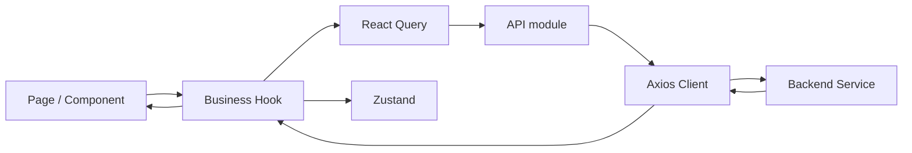
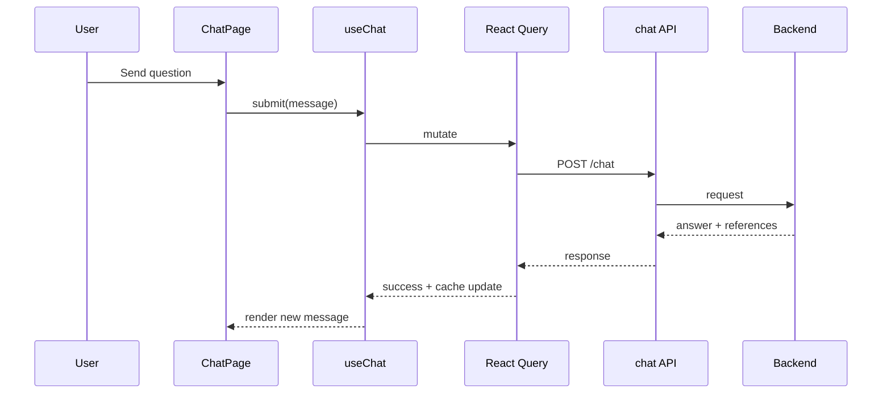
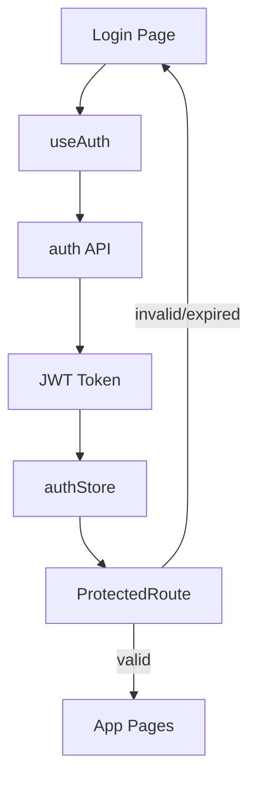

# AI.EnterpriseRAG Frontend Handbook / AI.EnterpriseRAG 前端手册

Enterprise-grade frontend for AI Enterprise RAG platform.  
面向 AI Enterprise RAG 平台的企业级前端工程文档。

This document is intentionally comprehensive for mixed teams (junior/senior, Chinese/English).  
本手册面向中英文混合团队，覆盖从入门到架构治理的完整信息。

## Start Here / 快速导航

EN:
- Human developers: start with this README, then use [AI_FRONTEND_IMPLEMENTATION_GUIDE.md](AI_FRONTEND_IMPLEMENTATION_GUIDE.md) for implementation patterns and delivery checklist.
- AI agents: use [AI_FRONTEND_IMPLEMENTATION_GUIDE.md](AI_FRONTEND_IMPLEMENTATION_GUIDE.md) as the primary execution guide before making any code changes.

中文：
- 人类开发者：先阅读本 README，再查看 [AI_FRONTEND_IMPLEMENTATION_GUIDE.md](AI_FRONTEND_IMPLEMENTATION_GUIDE.md) 获取实现模式与交付清单。
- AI 代理：编码前请优先阅读 [AI_FRONTEND_IMPLEMENTATION_GUIDE.md](AI_FRONTEND_IMPLEMENTATION_GUIDE.md) 作为执行规范。

---

## 1. Executive Summary / 执行摘要

EN:
- This frontend serves enterprise knowledge Q&A and management scenarios: Chat, Documents, Agent Workspace, Admin (RBAC).
- Phase 1 and Phase 2 are completed.
- The codebase follows modern React + TypeScript patterns with clear layering and operational guardrails.
- It is suitable for enterprise extension when teams follow module registry, i18n, query key, and test quality gates.

中文：
- 本前端覆盖企业知识问答与管理场景：聊天、文档、Agent 工作区、后台管理（RBAC）。
- 第一阶段与第二阶段已完成。
- 项目采用现代 React + TypeScript 分层模式，并具备工程化质量门禁。
- 只要团队严格遵守模块注册、i18n、Query Key 与测试规范，就可持续进行企业级扩展。

---

## 2. Business Context and Goals / 业务背景与目标

EN:
- Problem: traditional enterprise knowledge is fragmented (documents, tickets, SOP, tribal knowledge).
- Goal: provide a unified intelligent front-end portal for retrieval, Q&A, governance, and operations.
- Non-goal: this frontend does not implement model training or vector indexing itself; it orchestrates backend capabilities.

中文：
- 背景问题：企业知识分散在文档、工单、流程和个人经验中，检索与复用成本高。
- 目标：构建统一智能门户，支持检索问答、文档治理、权限治理、运营可视化。
- 非目标：前端不负责模型训练或向量入库，仅负责编排后端能力与体验治理。

---

## 3. Technology Stack and Why / 技术栈与选型原因

### 3.1 Core Stack / 核心栈
- React 18
- TypeScript 5
- Vite 5
- React Router 6
- Ant Design 5
- React Query 5
- Zustand 4
- Axios
- Vitest + Testing Library
- Sentry (`@sentry/react`)

### 3.2 Why This Stack / 为什么这样选

EN:
1. React + TypeScript gives long-term maintainability and safer refactoring.
2. React Query clearly separates server state from UI/client state.
3. Zustand keeps local state simple without over-architecting.
4. Ant Design accelerates enterprise UI consistency.
5. Vitest + Testing Library provide practical, fast unit test coverage.
6. Sentry + performance service improve production observability.

中文：
1. React + TypeScript 有利于长期维护与安全重构。
2. React Query 明确区分服务端状态与本地状态。
3. Zustand 轻量管理本地状态，避免过度设计。
4. Ant Design 快速形成企业后台一致的交互规范。
5. Vitest + Testing Library 提供高性价比测试能力。
6. Sentry + 性能服务提升线上可观测性与问题定位效率。

---

## 4. Current Implementation Status / 当前实现状态

### Phase 1 (Architecture Foundation) / 第一阶段（架构基础）
1. Module registry for dynamic route/menu/permission.
2. Full i18n text centralization.
3. Reusable page templates for non-CRUD screens.
4. Query Key standards and invalidation documentation.

### Phase 2 (Quality + Observability) / 第二阶段（质量与可观测性）
1. Unit testing infrastructure and baseline tests.
2. Auth/JWT/error handling tests.
3. Performance monitoring service (web vitals/API timing).
4. Sentry integration pipeline.

---

## 5. Quick Start / 快速启动

### Prerequisites / 前置要求
- Node.js 18+
- npm 9+

### Install / 安装依赖
```bash
npm install
```

### Environment / 环境变量
Create `.env.development`:
```bash
VITE_API_BASE_URL=http://localhost:5243
VITE_API_TIMEOUT=300000
VITE_ANALYTICS_ENABLED=true
VITE_SENTRY_DSN=
```

### Run / 启动
```bash
npm run dev
```

### Validate / 验证
```bash
npm run lint
npm run type-check
npm run test
npm run build
```

If all pass, your local environment is ready.  
以上命令全部通过即表示本地环境可用。

---

## 6. How the System Works / 系统如何工作

### 6.1 Runtime Flow / 运行时流程



EN:
- Page triggers user actions.
- Hook performs query/mutation and coordinates optimistic updates/invalidation.
- API module isolates endpoint details.
- Axios client applies auth headers and global error handling.

中文：
- 页面发起用户操作。
- Hook 负责查询/变更与缓存失效、状态协调。
- API 层屏蔽具体接口细节。
- Axios 客户端统一处理鉴权头与全局错误策略。

### 6.2 Data Flow (Chat Example) / 数据流（聊天示例）



### 6.3 Auth and Guard Flow / 鉴权与路由保护流程



---

## 7. Architecture and Layer Responsibilities / 架构与分层职责

1. Page Layer / 页面层
- Compose UI and interaction only.
- No raw HTTP calls.

2. Hook Layer / Hook 业务层
- Orchestrate query, mutation, cache invalidation, and local interactions.

3. API Layer / API 层
- Encapsulate backend contracts.
- Reuse shared Axios client.

4. Store Layer / 本地状态层
- Keep local/session state only (auth, locale, ui preferences).

5. Config Layer / 配置层
- Module registry, query keys, i18n text, error policy.

6. Service Layer / 服务层
- Notification, monitoring, performance, global utility services.

---

## 8. Functional Modules / 功能模块

1. Authentication / 认证
- JWT login/logout
- token format + expiration validation
- route guarding

2. Chat / 智能问答
- multi-session chat
- markdown answer rendering
- reference/source display

3. Document / 文档管理
- list/upload/delete/status flows

4. Agent Workspace / Agent 工作区
- step-by-step execution display
- tool invocation progress visualization

5. Admin / 管理后台
- dashboard
- user/role/permission management
- RBAC debug tools

6. i18n / 多语言
- centralized text dictionary
- locale switching with AntD and dayjs linkage

---

## 9. Engineering Workflow / 工程流程

### 9.1 Daily Commands / 日常命令
```bash
npm run dev
npm run test
npm run test:watch
npm run test:coverage
npm run lint
npm run lint:fix
npm run format
npm run format:check
npm run type-check
npm run build
```

### 9.2 Feature Delivery Workflow / 功能交付流程

1. Clarify requirements and permission impact.
2. Add or update types and API contracts.
3. Implement hook-level business logic.
4. Build page/component integration.
5. Register module route/menu/permission if needed.
6. Add i18n keys.
7. Add/adjust tests.
8. Run full quality gate before PR.

### 9.3 Definition of Done / 完成标准

A PR is done only if all are true:
1. layering rules are respected
2. i18n is complete
3. module registry is updated where relevant
4. tests pass
5. lint/type-check/test/build pass
6. docs updated when behavior changed

---

## 10. Extension Guide / 扩展指南

### 10.1 Add a New Business Module / 新增业务模块

1. create page(s) in `src/pages/...`
2. create API calls in `src/api/...`
3. add hook in `src/hooks/...`
4. add text keys in `src/config/uiText.ts`
5. register route/menu/permission in `src/config/modules.ts`
6. add query keys in `src/config/queryKeys.ts`
7. add tests in `src/__tests__/`

### 10.2 Add a New Permission / 新增权限

1. define permission code (module.action)
2. map it in module config
3. apply guard in page/component action entry
4. verify with RBAC debug page

### 10.3 Add a New Language Key / 新增文案键

1. add key to both zh-CN and en-US dictionaries
2. consume via centralized text accessor
3. avoid hardcoded business text in components/pages

---

## 11. Maintenance Guide / 维护指南

### 11.1 Maintainability Principles / 可维护性原则

EN:
- Keep boundaries strict (page/hook/api/store).
- Keep business logic in hooks, not in components.
- Keep contracts typed and reusable.

中文：
- 严格遵守 page/hook/api/store 边界。
- 业务逻辑集中在 hook，不下沉到组件。
- 接口契约必须强类型可复用。

### 11.2 Refactoring Safety / 重构安全策略

1. change types first
2. update call sites with TS guidance
3. run unit tests
4. run build before merge

### 11.3 Troubleshooting Checklist / 故障排查清单

Before requesting help:
1. command executed
2. full error log
3. changed file list
4. expected vs actual
5. lint/type-check/test/build status

---

## 12. Security and Reliability / 安全与稳定性

1. Use shared API client for auth/error policies.
2. Keep 401/403 handling consistent.
3. Sanitize risky text content in the response/error pipeline.
4. Avoid logging sensitive payloads in production.
5. Validate token format and expiration before use.

---

## 13. Modern Best Practice Assessment / 现代最佳实践评估

### What is modern in this project / 当前现代化实践

EN:
- React 18 + TS strict typing
- React Query for server state patterns
- configuration-driven modules
- centralized i18n and error policy
- baseline testing and observability

中文：
- React 18 + TypeScript 严格类型
- React Query 服务端状态治理
- 配置驱动模块注册
- 文案与错误策略集中治理
- 基础测试与可观测性建设

### Is this enterprise-ready? / 是否具备企业级能力

EN:
- Yes, for current scope and medium-scale team collaboration.
- To reach stronger enterprise maturity, continue with E2E, CI quality gates, and accessibility audits.

中文：
- 在当前范围与中等规模协作下，已具备企业级可用性。
- 若要进一步提升成熟度，建议补齐 E2E、CI 门禁、可访问性审计。

### Recommended next improvements / 建议下一步

1. Add E2E coverage for core journeys.
2. Enforce CI checks for lint/type-check/test/build.
3. Add accessibility checks (keyboard + screen reader + axe).
4. Add bundle budget and performance alert thresholds.
5. Add release/versioning and rollback playbook.

---

## 14. Key References / 关键参考文档

- `FIRST_PRIORITY_COMPLETE.md`
- `FIRST_PRIORITY_COMPLETION.md`
- `QUERY_KEYS_GUIDE.md`
- `PHASE_2_IMPROVEMENTS.md`
- `PHASE_2_COMPLETE.md`
- `src/config/MODULES_GUIDE.md`
- `src/pages/Templates/TEMPLATES_GUIDE.md`

---

## 15. New Joiner First-Day Plan / 新成员首日计划

EN:
1. Run local setup and quality commands.
2. Read architecture sections and one complete feature flow.
3. Make one small non-breaking change (text/config).
4. Add/update one unit test.
5. Open PR with checklist evidence.

中文：
1. 完成本地启动与质量命令验证。
2. 阅读架构章节并走通一条完整功能链路。
3. 提交一个小且无破坏性的变更（如文案/配置）。
4. 补充或更新一个单元测试。
5. 携带清单证据发起 PR。
