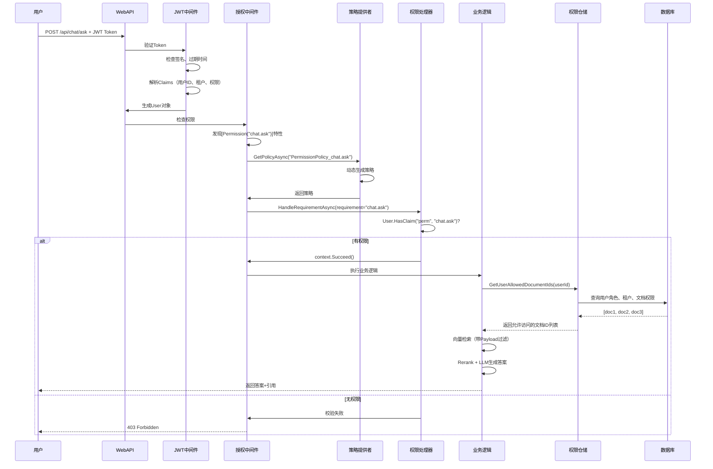

# 🔒 AI.EnterpriseRAG 企业级权限控制系统深度解析

> **作者**: AI.EnterpriseRAG 技术团队  
> **日期**: 2025-01-22  
> **版本**: v2.0  
> **适用场景**: 多租户SaaS、企业内部知识管理、文档协作平台

---

## 📋 目录

1. [权限控制架构概览](#1-权限控制架构概览)
2. [核心概念与设计理念](#2-核心概念与设计理念)
3. [多租户隔离实现](#3-多租户隔离实现)
4. [细粒度文档权限](#4-细粒度文档权限)
5. [RBAC角色管理](#5-rbac角色管理)
6. [JWT权限注入机制](#6-jwt权限注入机制)
7. [动态权限策略](#7-动态权限策略)
8. [向量检索权限过滤](#8-向量检索权限过滤)
9. [权限校验全流程](#9-权限校验全流程)
10. [实战案例](#10-实战案例)
11. [性能优化与扩展](#11-性能优化与扩展)

---

## 1. 权限控制架构概览

### 1.1 整体架构图

```
┌─────────────────────────────────────────────────────────────────┐
│                         用户请求                                  │
│                   (HTTP + JWT Token)                            │
└──────────────────────┬──────────────────────────────────────────┘
                       │
                       ▼
┌──────────────────────────────────────────────────────────────────┐
│                    ASP.NET Core 中间件管道                        │
├──────────────────────────────────────────────────────────────────┤
│  1. JWT认证中间件 (JwtBearerMiddleware)                          │
│     → 验证Token签名、过期时间                                      │
│     → 解析Claims（用户ID、租户ID、权限列表）                       │
│                                                                  │
│  2. 授权中间件 (AuthorizationMiddleware)                         │
│     → 检查[Permission]特性                                        │
│     → 调用DynamicPermissionPolicyProvider                        │
│     → 执行PermissionHandler校验                                   │
└──────────────────────┬──────────────────────────────────────────┘
                       │
                       ▼
┌──────────────────────────────────────────────────────────────────┐
│                     业务逻辑层（UseCases）                         │
├──────────────────────────────────────────────────────────────────┤
│  • ChatUseCase: 问答权限控制                                      │
│    → 调用PermissionService.GetUserAllowedDocumentIds()          │
│    → 过滤可访问的文档                                             │
│                                                                  │
│  • DocumentUseCase: 文档操作权限控制                              │
│    → 检查文档所有权                                               │
│    → 验证多租户隔离                                               │
└──────────────────────┬──────────────────────────────────────────┘
                       │
                       ▼
┌──────────────────────────────────────────────────────────────────┐
│                    数据访问层（Repositories）                      │
├──────────────────────────────────────────────────────────────────┤
│  • PermissionRepository: 权限数据查询                             │
│    → 查询用户角色                                                 │
│    → 查询文档权限                                                 │
│    → 应用租户隔离                                                 │
│                                                                  │
│  • 向量库（Qdrant）: Payload过滤                                  │
│    → filter: { "document_id": [allowedIds] }                    │
└──────────────────────────────────────────────────────────────────┘
```

### 1.2 核心组件说明

| 组件 | 文件位置 | 职责 |
|------|---------|------|
| **TokenService** | `Infrastructure/Security/TokenService.cs` | 生成JWT，注入权限Claims |
| **PermissionHandler** | `Infrastructure/Authorization/PermissionHandler.cs` | 验证用户是否拥有特定权限 |
| **DynamicPermissionPolicyProvider** | `Infrastructure/Authorization/DynamicPermissionPolicyProvider.cs` | 动态生成授权策略 |
| **PermissionRepository** | `Infrastructure/Persistence/Repositories/PermissionRepository.cs` | 查询用户可访问的文档ID |
| **PermissionAttribute** | `WebAPI/Attribute/PermissionAttribute.cs` | 控制器权限注解 |
| **DocumentPermissions** | `Domain/Entities/DocumentPermissions.cs` | 细粒度权限实体 |

---

## 2. 核心概念与设计理念

### 2.1 三层权限模型

```
┌─────────────────────────────────────────────────────────────┐
│                      第1层：功能权限                           │
│                    (RBAC - 基于角色)                          │
├─────────────────────────────────────────────────────────────┤
│  • doc.read: 文档读取权限                                     │
│  • doc.upload: 文档上传权限                                   │
│  • doc.delete: 文档删除权限                                   │
│  • chat.ask: 智能问答权限                                     │
│  • admin.manage: 系统管理权限                                 │
└─────────────────────────────────────────────────────────────┘

┌─────────────────────────────────────────────────────────────┐
│                      第2层：数据权限                           │
│                  (基于所有权 + 租户隔离)                       │
├─────────────────────────────────────────────────────────────┤
│  • UploadedBy: 用户只能访问自己上传的文档                      │
│  • TenantId: 用户只能访问同租户的文档                          │
│  • IsPublic: 公开文档所有人可见                                │
└─────────────────────────────────────────────────────────────┘

┌─────────────────────────────────────────────────────────────┐
│                  第3层：细粒度文档权限                          │
│              (UserDocumentPermission 按位标志)                │
├─────────────────────────────────────────────────────────────┤
│  • Read (1): 只读权限                                         │
│  • Write (2): 编辑权限                                        │
│  • Delete (4): 删除权限                                       │
│  • Share (8): 分享/授权权限                                   │
│  • 支持组合：Read | Write = 3（读写权限）                      │
└─────────────────────────────────────────────────────────────┘
```

### 2.2 设计原则

#### 原则1：最小权限原则（Principle of Least Privilege）
**实现**：
- 新用户默认只能访问自己上传的文档
- 需要显式授权才能访问他人文档
- 权限可以设置过期时间

#### 原则2：纵深防御（Defense in Depth）
**实现**：
```csharp
// 第1层：控制器级别
[Permission("doc.upload")]  // ← 功能权限
public async Task<IActionResult> UploadDocument(...)

// 第2层：业务逻辑级别
var allowedDocIds = await _permissionService.GetUserAllowedDocumentIdsAsync(userId);

// 第3层：数据库查询级别
.Where(d => d.UploadedBy == userId || d.TenantId == tenantId)

// 第4层：向量库Payload过滤
filter: { "document_id": allowedDocIds }
```

#### 原则3：性能优先（Performance First）
**实现**：
- JWT中直接携带权限列表（减少数据库查询）
- 向量库原生Payload过滤（避免后过滤）
- 权限策略缓存（ConcurrentDictionary）

---

## 3. 多租户隔离实现

### 3.1 租户隔离模型

**数据库层隔离**：

```sql
-- Document表结构（包含租户字段）
CREATE TABLE documents (
    Id CHAR(36) PRIMARY KEY,
    Name VARCHAR(500) NOT NULL,
    FileType VARCHAR(50) NOT NULL,
    StoragePath VARCHAR(1000) NOT NULL,
    Status INT NOT NULL,
    
    -- 租户隔离字段 ↓
    UploadedBy VARCHAR(100) NOT NULL,     -- 上传者账号
    TenantId VARCHAR(50),                 -- 租户ID（NULL=无租户）
    IsPublic TINYINT(1) DEFAULT 0,        -- 是否公开
    
    INDEX IX_documents_TenantId (TenantId),
    INDEX IX_documents_UploadedBy (UploadedBy),
    INDEX IX_documents_TenantId_Status (TenantId, Status)  -- 组合索引
);
```

### 3.2 租户隔离逻辑

**代码实现**（`PermissionRepository.cs`）：

```csharp
// 第34-86行：核心权限过滤逻辑
public async Task<List<string>> GetUserAllowedDocumentIdsAsync(
    string userId, 
    CancellationToken ct = default)
{
    // 1. 查询用户信息（包含角色和租户）
    var user = await _context.Users
        .Include(u => u.UserRoles)
        .ThenInclude(ur => ur.Role)
        .FirstOrDefaultAsync(u => u.Account == userId, ct);

    if (user == null)
    {
        _logger.LogWarning("[权限] 用户 {UserId} 不存在", userId);
        return new List<string>();
    }

    // 2. 超级管理员：绕过租户隔离，访问所有文档
    var isAdmin = user.UserRoles.Any(ur => ur.Role.RoleCode == "admin");
    if (isAdmin)
    {
        var allDocuments = await _context.Documents
            .Where(d => d.Status == DocumentStatus.Vectorized)
            .Select(d => d.Id.ToString())
            .ToListAsync(ct);

        _logger.LogInformation(
            "[权限] 管理员 {UserId} 可访问所有文档：{Count}个", 
            userId, allDocuments.Count);
        return allDocuments;
    }

    // 3. 普通用户：三重过滤
    var tenantId = user.TenantId;

    var documents = await _context.Documents
        .Where(d =>
            d.Status == DocumentStatus.Vectorized &&
            (
                d.UploadedBy == userId ||                      // ① 自己上传的文档
                d.IsPublic ||                                  // ② 公开文档
                (d.TenantId == tenantId &&                     // ③ 同租户文档
                 !string.IsNullOrEmpty(tenantId))
            )
        )
        .Select(d => d.Id.ToString())
        .ToListAsync(ct);

    _logger.LogInformation(
        "[权限] 用户 {UserId}（租户：{TenantId}）可访问文档：{Count}个", 
        userId, tenantId ?? "无", documents.Count);

    return documents;
}
```

### 3.3 租户隔离场景示例

| 场景 | 用户 | TenantId | 可访问文档 |
|------|------|----------|-----------|
| **场景1：单租户员工** | user1@company-a.com | company-a | ✓ 自己上传的<br>✓ company-a租户内的<br>✓ 公开文档 |
| **场景2：管理员** | admin@platform.com | null | ✓ 所有已向量化的文档 |
| **场景3：无租户用户** | freelancer@email.com | null | ✓ 只能访问自己上传的<br>✓ 公开文档 |
| **场景4：跨租户** | user2@company-b.com | company-b | ✗ 无法访问company-a的文档<br>✓ 可访问公开文档 |

---

## 4. 细粒度文档权限

### 4.1 按位标志权限设计

**实体定义**（`DocumentPermissions.cs` 第9-17行）：

```csharp
[Flags]
public enum DocumentPermissionType
{
    None = 0,           // 二进制：0000
    Read = 1,           // 二进制：0001
    Write = 2,          // 二进制：0010
    Delete = 4,         // 二进制：0100
    Share = 8,          // 二进制：1000
    Admin = 15          // 二进制：1111 (所有权限)
}
```

**为什么使用按位标志？**

✅ **优势**：
1. **存储高效**：单个INT字段存储多个权限
2. **组合灵活**：`Read | Write = 3`（读写权限）
3. **判断快速**：位运算比字符串匹配快10倍
4. **扩展方便**：可支持16种权限（2^4）

**权限判断示例**：

```csharp
// 判断是否有读权限
bool hasRead = (permission & DocumentPermissionType.Read) != 0;

// 判断是否有读写权限
bool hasReadWrite = (permission & (DocumentPermissionType.Read | DocumentPermissionType.Write)) 
                    == (DocumentPermissionType.Read | DocumentPermissionType.Write);

// 添加写权限
permission |= DocumentPermissionType.Write;

// 移除删除权限
permission &= ~DocumentPermissionType.Delete;
```

### 4.2 用户-文档权限表

**表结构**（`UserDocumentPermission` 实体）：

```csharp
public class UserDocumentPermission
{
    public Guid Id { get; set; }
    public long UserId { get; set; }                      // 用户ID
    public Guid DocumentId { get; set; }                  // 文档ID
    public DocumentPermissionType PermissionType { get; set; }  // 权限类型（按位）
    public string GrantedBy { get; set; }                 // 授权人
    public DateTime GrantedAt { get; set; }               // 授权时间
    public DateTime? ExpiresAt { get; set; }              // 过期时间（NULL=永久）
    public bool IsActive { get; set; }                    // 是否激活
    public string? Reason { get; set; }                   // 授权原因
}
```

**数据库表设计**：

```sql
CREATE TABLE UserDocumentPermission (
    Id CHAR(36) PRIMARY KEY,
    UserId BIGINT NOT NULL,
    DocumentId CHAR(36) NOT NULL,
    PermissionType INT NOT NULL COMMENT '按位标志：1=Read, 2=Write, 4=Delete, 8=Share',
    GrantedBy VARCHAR(100) NOT NULL COMMENT '授权人账号',
    GrantedAt DATETIME NOT NULL DEFAULT CURRENT_TIMESTAMP,
    ExpiresAt DATETIME NULL COMMENT '过期时间（NULL=永久）',
    IsActive TINYINT(1) NOT NULL DEFAULT 1,
    Reason VARCHAR(500) NULL,
    
    INDEX IX_UDP_UserId (UserId),
    INDEX IX_UDP_DocumentId (DocumentId),
    INDEX IX_UDP_ExpiresAt (ExpiresAt),
    UNIQUE KEY UK_UDP_User_Doc (UserId, DocumentId),
    
    FOREIGN KEY (UserId) REFERENCES sys_users(Id) ON DELETE CASCADE,
    FOREIGN KEY (DocumentId) REFERENCES documents(Id) ON DELETE CASCADE
);
```

### 4.3 角色-文档权限表（批量授权）

**适用场景**：某个部门的所有人都需要访问特定文档

```csharp
public class RoleDocumentPermission
{
    public Guid Id { get; set; }
    public long RoleId { get; set; }                      // 角色ID
    public Guid DocumentId { get; set; }                  // 文档ID
    public DocumentPermissionType PermissionType { get; set; }
    // ...其他字段同UserDocumentPermission
}
```

**实战示例**：

```csharp
// 示例：为"研发部"角色授予某技术文档的只读权限
var rolePermission = new RoleDocumentPermission
{
    RoleId = devDepartmentRoleId,
    DocumentId = techDocId,
    PermissionType = DocumentPermissionType.Read,
    GrantedBy = "admin",
    GrantedAt = DateTime.Now,
    ExpiresAt = DateTime.Now.AddMonths(3),  // 3个月后过期
    Reason = "研发部需要查阅技术规范"
};

await _context.RoleDocumentPermissions.AddAsync(rolePermission);
await _context.SaveChangesAsync();
```

### 4.4 权限优先级

```
┌──────────────────────────────────────────────────────────┐
│                      权限继承与优先级                       │
├──────────────────────────────────────────────────────────┤
│  1. 直接授权（UserDocumentPermission）        [最高优先级] │
│     → 覆盖角色权限                                        │
│     → 用户A被单独授予某文档的Write权限                     │
│                                                          │
│  2. 角色权限（RoleDocumentPermission）        [中等优先级] │
│     → 所有拥有该角色的用户继承权限                         │
│     → "研发部"角色拥有技术文档的Read权限                   │
│                                                          │
│  3. 所有权（UploadedBy）                      [默认权限]  │
│     → 文档上传者自动拥有Admin权限                          │
│     → 无需显式授权                                        │
│                                                          │
│  4. 租户隔离（TenantId）                      [基础权限]  │
│     → 同租户用户默认Read权限                              │
│     → 可通过IsPublic=false禁用                           │
└──────────────────────────────────────────────────────────┘
```

---

## 5. RBAC角色管理

### 5.1 角色模型设计

**核心实体**（`SysUser.cs`）：

```csharp
// 用户表
public class SysUser
{
    public long Id { get; set; }
    public string Account { get; set; }          // 登录账号
    public string PasswordHash { get; set; }     // 密码哈希
    public string UserName { get; set; }         // 显示名称
    public bool IsEnabled { get; set; }          // 是否激活
    public string TenantId { get; set; }         // 租户ID
    
    // 导航属性：用户-角色多对多关系
    public virtual ICollection<SysUserRole> UserRoles { get; set; }
}

// 角色表
public class SysRole
{
    public long Id { get; set; }
    public string RoleName { get; set; }         // 角色名称（如"系统管理员"）
    public string RoleCode { get; set; }         // 角色代码（如"admin"）
    
    // 导航属性
    public virtual ICollection<SysUserRole> UserRoles { get; set; }
    public virtual ICollection<RolePermission> RolePermissions { get; set; }
}

// 用户-角色关联表
public class SysUserRole
{
    public long UserId { get; set; }
    public long RoleId { get; set; }
    
    public SysUser User { get; set; }
    public SysRole Role { get; set; }
}

// 权限表
public class Permission
{
    public long Id { get; set; }
    public string Code { get; set; }             // 权限代码（doc.read）
    public string Name { get; set; }             // 权限名称（文档读取）
    
    public virtual ICollection<RolePermission> RolePermissions { get; set; }
}

// 角色-权限关联表
public class RolePermission
{
    public long RoleId { get; set; }
    public long PermissionId { get; set; }
    
    public SysRole Role { get; set; }
    public Permission Permission { get; set; }
}
```

### 5.2 RBAC关系图

```
┌─────────────────────────────────────────────────────────────┐
│                        RBAC 5表模型                          │
└─────────────────────────────────────────────────────────────┘

        SysUser (用户)
            ↓ 1:N
        SysUserRole (用户-角色)
            ↓ N:1
        SysRole (角色)
            ↓ 1:N
        RolePermission (角色-权限)
            ↓ N:1
        Permission (权限)

┌─────────────────────────────────────────────────────────────┐
│                        数据示例                              │
├─────────────────────────────────────────────────────────────┤
│  用户表 (SysUser)                                            │
│  ┌────┬───────────┬──────────┐                              │
│  │ Id │ Account   │ TenantId │                              │
│  ├────┼───────────┼──────────┤                              │
│  │ 1  │ admin     │ null     │                              │
│  │ 2  │ zhang.san │ tenant-a │                              │
│  │ 3  │ li.si     │ tenant-a │                              │
│  └────┴───────────┴──────────┘                              │
│                                                              │
│  角色表 (SysRole)                                            │
│  ┌────┬──────────────┬──────────┐                           │
│  │ Id │ RoleName     │ RoleCode │                           │
│  ├────┼──────────────┼──────────┤                           │
│  │ 1  │ 系统管理员   │ admin    │                           │
│  │ 2  │ 普通用户     │ member   │                           │
│  │ 3  │ 访客         │ guest    │                           │
│  └────┴──────────────┴──────────┘                           │
│                                                              │
│  权限表 (Permission)                                         │
│  ┌────┬─────────────┬──────────────┐                        │
│  │ Id │ Code        │ Name         │                        │
│  ├────┼─────────────┼──────────────┤                        │
│  │ 1  │ doc.read    │ 文档读取     │                        │
│  │ 2  │ doc.upload  │ 文档上传     │                        │
│  │ 3  │ doc.delete  │ 文档删除     │                        │
│  │ 4  │ chat.ask    │ 智能问答     │                        │
│  │ 5  │ admin.users │ 用户管理     │                        │
│  └────┴─────────────┴──────────────┘                        │
│                                                              │
│  用户角色关联 (SysUserRole)                                  │
│  ┌────────┬────────┐                                        │
│  │ UserId │ RoleId │                                        │
│  ├────────┼────────┤                                        │
│  │ 1      │ 1      │  ← admin拥有"系统管理员"角色             │
│  │ 2      │ 2      │  ← zhang.san拥有"普通用户"角色          │
│  │ 3      │ 3      │  ← li.si拥有"访客"角色                  │
│  └────────┴────────┘                                        │
│                                                              │
│  角色权限关联 (RolePermission)                               │
│  ┌────────┬──────────────┐                                  │
│  │ RoleId │ PermissionId │                                  │
│  ├────────┼──────────────┤                                  │
│  │ 1      │ 1,2,3,4,5    │  ← 管理员拥有所有权限             │
│  │ 2      │ 1,2,4        │  ← 普通用户可读/上传/问答         │
│  │ 3      │ 1,4          │  ← 访客只能读和问答               │
│  └────────┴──────────────┘                                  │
└─────────────────────────────────────────────────────────────┘
```

### 5.3 角色权限查询

**查询用户所有权限**：

```csharp
public async Task<List<string>> GetUserPermissionsAsync(long userId)
{
    var permissions = await _context.Users
        .Where(u => u.Id == userId)
        .SelectMany(u => u.UserRoles)                    // 用户 → 角色
        .SelectMany(ur => ur.Role.RolePermissions)       // 角色 → 权限
        .Select(rp => rp.Permission.Code)                // 权限代码
        .Distinct()
        .ToListAsync();

    return permissions;
}

// 示例：zhang.san用户的权限查询结果
// ["doc.read", "doc.upload", "chat.ask"]
```

---

## 6. JWT权限注入机制

### 6.1 Token生成流程

**核心代码**（`TokenService.cs` 第20-54行）：

```csharp
public string GenerateAccessToken(SysUser user, List<string> permissions)
{
    // 1. 构建Claims（声明）
    var claims = new List<Claim>
    {
        new Claim(JwtRegisteredClaimNames.Sub, user.Id.ToString()),     // 用户ID
        new Claim(JwtRegisteredClaimNames.UniqueName, user.Account),    // 账号
        new Claim("tid", user.TenantId ?? string.Empty),                // 租户ID
    };

    // 2. 核心：将权限列表注入为多个Claim
    //    这样可以直接用 User.HasClaim("perm", "doc.read") 判断
    foreach (var p in permissions)
    {
        claims.Add(new Claim("perm", p));
    }

    // 3. 生成签名密钥
    var secretKey = _config["Jwt:SecretKey"] 
        ?? throw new InvalidOperationException("JWT Secret not configured");
    var key = new SymmetricSecurityKey(Encoding.UTF8.GetBytes(secretKey));
    var creds = new SigningCredentials(key, SecurityAlgorithms.HmacSha256);

    // 4. 创建Token描述符
    var handler = new JsonWebTokenHandler();
    var descriptor = new SecurityTokenDescriptor
    {
        Issuer = _config["Jwt:Issuer"] ?? "rag.auth",
        Audience = _config["Jwt:Audience"] ?? "rag.api",
        Subject = new ClaimsIdentity(claims),
        Expires = DateTime.UtcNow.AddMinutes(30),           // 30分钟过期
        SigningCredentials = creds
    };

    // 5. 生成Token字符串
    return handler.CreateToken(descriptor);
}
```

### 6.2 JWT Token示例

**登录成功后的Token结构**：

```json
{
  "header": {
    "alg": "HS256",
    "typ": "JWT"
  },
  "payload": {
    "sub": "1",                           // 用户ID
    "unique_name": "admin",               // 账号
    "tid": "tenant-a",                    // 租户ID
    "perm": [                             // 权限列表 ↓
      "doc.read",
      "doc.upload",
      "doc.delete",
      "chat.ask",
      "admin.users"
    ],
    "iss": "rag.auth",                    // 签发者
    "aud": "rag.api",                     // 受众
    "exp": 1706000000,                    // 过期时间戳
    "iat": 1705998200                     // 签发时间戳
  },
  "signature": "HMACSHA256(base64UrlEncode(header) + '.' + base64UrlEncode(payload), secret)"
}
```

**编码后的Token**（实际传输格式）：

```
eyJhbGciOiJIUzI1NiIsInR5cCI6IkpXVCJ9.eyJzdWIiOiIxIiwidW5pcXVlX25hbWUiOiJhZG1pbiIsInRpZCI6InRlbmFudC1hIiwicGVybSI6WyJkb2MucmVhZCIsImRvYy51cGxvYWQiLCJkb2MuZGVsZXRlIiwiY2hhdC5hc2siLCJhZG1pbi51c2VycyJdLCJpc3MiOiJyYWcuYXV0aCIsImF1ZCI6InJhZy5hcGkiLCJleHAiOjE3MDYwMDAwMDAsImlhdCI6MTcwNTk5ODIwMH0.xxx
```

### 6.3 JWT配置（Program.cs）

```csharp
// JWT认证配置
builder.Services.AddAuthentication(JwtBearerDefaults.AuthenticationScheme)
    .AddJwtBearer(options =>
    {
        options.TokenValidationParameters = new TokenValidationParameters
        {
            ValidateIssuer = true,
            ValidateAudience = true,
            ValidateLifetime = true,
            ValidateIssuerSigningKey = true,
            RequireExpirationTime = true,

            // 必须与TokenService一致
            ValidIssuer = builder.Configuration["Jwt:Issuer"] ?? "rag.auth",
            ValidAudience = builder.Configuration["Jwt:Audience"] ?? "rag.api",

            IssuerSigningKey = new SymmetricSecurityKey(
                Encoding.UTF8.GetBytes(
                    builder.Configuration["Jwt:SecretKey"] ??
                    throw new InvalidOperationException("JWT密钥未配置")
                )
            ),

            // 关键：让系统正确识别Claim
            NameClaimType = JwtRegisteredClaimNames.UniqueName,  // 账号字段
            RoleClaimType = "perm",                              // 权限字段
        };

        // Token过期提示
        options.Events = new JwtBearerEvents
        {
            OnAuthenticationFailed = context =>
            {
                if (context.Exception is SecurityTokenExpiredException)
                {
                    context.Response.Headers["Token-Expired"] = "true";
                }
                return Task.CompletedTask;
            }
        };
    });
```

---

## 7. 动态权限策略

### 7.1 为什么需要动态策略？

**传统静态策略的问题**：

```csharp
// ❌ 硬编码方式：每个权限都要手动注册
builder.Services.AddAuthorization(options =>
{
    options.AddPolicy("doc.read", policy => policy.RequireClaim("perm", "doc.read"));
    options.AddPolicy("doc.upload", policy => policy.RequireClaim("perm", "doc.upload"));
    options.AddPolicy("doc.delete", policy => policy.RequireClaim("perm", "doc.delete"));
    options.AddPolicy("chat.ask", policy => policy.RequireClaim("perm", "chat.ask"));
    // ...需要注册几十个策略
});
```

**问题**：
- ❌ 代码冗长重复
- ❌ 新增权限需要修改代码
- ❌ 无法动态添加权限

### 7.2 动态策略实现

**DynamicPermissionPolicyProvider**（第8-52行）：

```csharp
public class DynamicPermissionPolicyProvider : IAuthorizationPolicyProvider
{
    private const string PermissionPolicyPrefix = "PermissionPolicy_";
    
    // 缓存策略，避免重复构建
    private readonly ConcurrentDictionary<string, AuthorizationPolicy> _policyCache = new();
    private readonly DefaultAuthorizationPolicyProvider _defaultProvider;

    public DynamicPermissionPolicyProvider(IOptions<AuthorizationOptions> options)
    {
        _defaultProvider = new DefaultAuthorizationPolicyProvider(options);
    }

    public async Task<AuthorizationPolicy?> GetPolicyAsync(string policyName)
    {
        // 1. 先尝试从默认提供者获取（支持静态策略、[Authorize(Roles="")]等）
        var policy = await _defaultProvider.GetPolicyAsync(policyName);
        if (policy != null)
            return policy;

        // 2. 如果是权限策略（PermissionPolicy_xxx），动态生成
        if (policyName.StartsWith(PermissionPolicyPrefix, StringComparison.OrdinalIgnoreCase))
        {
            return _policyCache.GetOrAdd(policyName, name =>
            {
                // 提取权限代码：PermissionPolicy_doc.read → doc.read
                var permission = name[PermissionPolicyPrefix.Length..];
                
                // 构建策略：要求已认证 + 拥有指定权限
                return new AuthorizationPolicyBuilder()
                    .RequireAuthenticatedUser()
                    .AddRequirements(new PermissionRequirement(permission))
                    .Build();
            });
        }

        // 3. 未识别的策略，返回null
        return null;
    }

    public Task<AuthorizationPolicy> GetDefaultPolicyAsync()
        => _defaultProvider.GetDefaultPolicyAsync();

    public Task<AuthorizationPolicy?> GetFallbackPolicyAsync()
        => _defaultProvider.GetFallbackPolicyAsync();
}
```

### 7.3 使用动态策略

**步骤1：注册DynamicPermissionPolicyProvider**

```csharp
// Program.cs
builder.Services.AddAuthorization();  // 不需要手动注册策略
builder.Services.AddScoped<IAuthorizationHandler, PermissionHandler>();
builder.Services.AddSingleton<IAuthorizationPolicyProvider, DynamicPermissionPolicyProvider>();
```

**步骤2：使用[Permission]特性**

```csharp
// DocumentController.cs
[HttpPost("upload")]
[Permission("doc.upload")]  // ← 自动生成策略"PermissionPolicy_doc.upload"
public async Task<IActionResult> UploadDocument(IFormFile file)
{
    // ...
}
```

**步骤3：PermissionAttribute实现**

```csharp
// PermissionAttribute.cs（第1-13行）
public class PermissionAttribute : AuthorizeAttribute
{
    private const string PolicyPrefix = "PermissionPolicy_";

    public PermissionAttribute(string permission)
    {
        // 将权限代码转换为策略名
        Policy = $"{PolicyPrefix}{permission}";
    }
}

// 使用示例
[Permission("doc.read")]    → Policy = "PermissionPolicy_doc.read"
[Permission("chat.ask")]    → Policy = "PermissionPolicy_chat.ask"
[Permission("admin.users")] → Policy = "PermissionPolicy_admin.users"
```

---

## 8. 向量检索权限过滤

### 8.1 为什么在向量层过滤？

**方案对比**：

```
┌─────────────────────────────────────────────────────────────┐
│         方案A：后过滤（性能差）❌                             │
├─────────────────────────────────────────────────────────────┤
│  1. 向量检索：获取100个最相似的chunks                         │
│  2. 应用层过滤：检查每个chunk的DocumentId是否在允许列表       │
│  3. 返回：可能只剩5个chunk（浪费95%的检索结果）               │
│                                                             │
│  缺点：                                                      │
│  • 无效检索浪费资源                                          │
│  • 可能没有足够的结果（用户只能访问3个文档）                  │
│  • 需要二次查询补充结果                                      │
└─────────────────────────────────────────────────────────────┘

┌─────────────────────────────────────────────────────────────┐
│         方案B：向量库原生过滤（性能好）✅                     │
├─────────────────────────────────────────────────────────────┤
│  1. 向量检索：直接在Qdrant中过滤                             │
│     filter: { "document_id": [允许的文档ID列表] }            │
│  2. 返回：直接获取用户有权限的top-K结果                       │
│                                                             │
│  优点：                                                      │
│  • 向量库原生支持，性能最优                                   │
│  • 一次查询完成，无需二次过滤                                │
│  • 结果都是有效的（100%命中率）                              │
└─────────────────────────────────────────────────────────────┘
```

### 8.2 实现代码

**ChatUseCase.cs（第69-95行）**：

```csharp
public async Task<(string Answer, List<string> References, decimal CostSeconds)> ChatAsync(
    string userId,
    string question,
    CancellationToken cancellationToken = default)
{
    // 第70-82行：权限前置过滤
    // ====================================
    // 1. 多租户路由：获取用户专属向量集合
    // ====================================
    var collectionName = await _permissionService.GetUserCollectionNameAsync(userId, cancellationToken);

    // ====================================
    // 2. 权限过滤：获取用户可访问的文档ID
    // ====================================
    var allowedDocIds = await _permissionService.GetUserAllowedDocumentIdsAsync(userId, cancellationToken);
    
    if (!allowedDocIds.Any())
    {
        _logger.LogWarning("用户{UserId}无文档权限", userId);
        return ("您暂无文档访问权限", validReferences, (decimal)stopwatch.Elapsed.TotalSeconds);
    }

    // 第85-87行：生成问题向量
    var queryVector = await _llmService.EmbeddingAsync(question, cancellationToken);
    if (queryVector == null || queryVector.Length == 0)
        throw new BusinessException(500, "向量生成失败");

    // 第90-95行：核心！带权限过滤的向量检索
    // ====================================
    // 3. Qdrant Payload过滤（向量库层过滤）
    // ====================================
    var filter = new Dictionary<string, object>
    {
        ["document_id"] = allowedDocIds  // ← 只检索这些文档的chunks
    };

    var matchedChunks = await _vectorStore.SearchAsync(
        collectionName,
        queryVector,
        topK: 20,
        filter: filter,  // ← 传递过滤条件
        cancellationToken: cancellationToken
    );

    // 后续：Rerank、上下文构建、LLM生成...
}
```

### 8.3 Qdrant Payload过滤实现

**QdrantVectorStore.cs（SearchAsync方法）**：

```csharp
public async Task<List<DocumentChunk>> SearchAsync(
    string collectionName,
    float[] queryVector,
    int topK = 5,
    Dictionary<string, object>? filter = null,
    CancellationToken cancellationToken = default)
{
    // 1. 构建Qdrant查询请求
    var request = new
    {
        vector = queryVector,
        limit = topK,
        with_payload = true,
        
        // 2. 核心：构建Payload过滤条件
        filter = filter != null ? new
        {
            must = new[]
            {
                new
                {
                    key = "document_id",
                    match = new
                    {
                        any = filter["document_id"]  // ← [guid1, guid2, guid3]
                    }
                }
            }
        } : null
    };

    // 3. 发送HTTP请求到Qdrant
    var response = await _httpClient.PostAsync(
        $"/collections/{collectionName}/points/search",
        JsonContent.Create(request),
        cancellationToken
    );

    // 4. 解析响应
    var result = await response.Content.ReadFromJsonAsync<QdrantSearchResponse>(cancellationToken);
    
    // 5. 转换为DocumentChunk
    return result.Result.Select(point => new DocumentChunk
    {
        Id = Guid.Parse(point.Id),
        DocumentId = Guid.Parse(point.Payload.document_id),
        Content = point.Payload.content,
        Similarity = point.Score
    }).ToList();
}
```

**Qdrant实际查询JSON**：

```json
POST /collections/enterprise_rag_collection/points/search
{
  "vector": [0.123, 0.456, ..., 0.789],
  "limit": 20,
  "with_payload": true,
  "filter": {
    "must": [
      {
        "key": "document_id",
        "match": {
          "any": [
            "3fa85f64-5717-4562-b3fc-2c963f66afa6",
            "8e2c5a1d-9876-4321-abcd-1234567890ab",
            "f12a34b5-6789-0abc-def0-123456789012"
          ]
        }
      }
    ]
  }
}
```

---

## 9. 权限校验全流程

### 9.1 完整请求流程图

```
┌─────────────────────────────────────────────────────────────┐
│  1. 用户登录 (POST /api/auth/login)                          │
├─────────────────────────────────────────────────────────────┤
│  请求：{ "account": "zhang.san", "password": "xxx" }        │
│     ↓                                                       │
│  AuthService.LoginAsync()                                   │
│     ↓                                                       │
│  验证密码 → 查询用户角色 → 查询角色权限                      │
│     ↓                                                       │
│  TokenService.GenerateAccessToken(user, permissions)        │
│     ↓                                                       │
│  响应：{ "accessToken": "eyJhbGc...", "refreshToken": "..." }│
└─────────────────────────────────────────────────────────────┘
                         ↓
┌─────────────────────────────────────────────────────────────┐
│  2. 调用API (POST /api/document/upload)                     │
├─────────────────────────────────────────────────────────────┤
│  请求头：Authorization: Bearer eyJhbGc...                   │
│  请求体：{ "file": ... }                                    │
│     ↓                                                       │
│  JwtBearerMiddleware（JWT认证中间件）                        │
│     ↓                                                       │
│  验证Token签名 → 检查过期时间 → 解析Claims                   │
│     ↓                                                       │
│  生成User对象（包含Claims）                                  │
│  • User.Identity.Name = "zhang.san"                        │
│  • User.FindFirst("tid").Value = "tenant-a"                │
│  • User.HasClaim("perm", "doc.upload") = true              │
└─────────────────────────────────────────────────────────────┘
                         ↓
┌─────────────────────────────────────────────────────────────┐
│  3. 授权中间件 (AuthorizationMiddleware)                    │
├─────────────────────────────────────────────────────────────┤
│  检查控制器特性：[Permission("doc.upload")]                  │
│     ↓                                                       │
│  调用DynamicPermissionPolicyProvider.GetPolicyAsync()       │
│     ↓                                                       │
│  策略名："PermissionPolicy_doc.upload"                       │
│     ↓                                                       │
│  创建策略：new PermissionRequirement("doc.upload")          │
│     ↓                                                       │
│  调用PermissionHandler.HandleRequirementAsync()             │
│     ↓                                                       │
│  检查：User.HasClaim("perm", "doc.upload")                  │
│     ↓                                                       │
│  ✓ 有权限 → context.Succeed(requirement)                    │
│  ✗ 无权限 → 返回403 Forbidden                               │
└─────────────────────────────────────────────────────────────┘
                         ↓
┌─────────────────────────────────────────────────────────────┐
│  4. 业务逻辑 (DocumentUseCase)                              │
├─────────────────────────────────────────────────────────────┤
│  从Token获取当前用户：                                       │
│  • var userId = User.FindFirst(JwtRegisteredClaimNames.    │
│    UniqueName).Value → "zhang.san"                         │
│  • var tenantId = User.FindFirst("tid").Value → "tenant-a" │
│     ↓                                                       │
│  保存文档到数据库：                                          │
│  • Document.UploadedBy = userId                            │
│  • Document.TenantId = tenantId                            │
│  • Document.IsPublic = false                               │
│     ↓                                                       │
│  返回：{ "documentId": "...", "status": "处理中" }          │
└─────────────────────────────────────────────────────────────┘
```

### 9.2 权限校验时序图



---

## 10. 实战案例

### 案例1：文档上传权限控制

**需求**：只有拥有`doc.upload`权限的用户才能上传文档

**实现步骤**：

**步骤1：控制器添加权限特性**

```csharp
// DocumentController.cs
[HttpPost("upload")]
[Authorize]                      // ← 必须登录
[Permission("doc.upload")]       // ← 必须有doc.upload权限
public async Task<IActionResult> UploadDocument(IFormFile file)
{
    // 1. 从Token获取当前用户
    var userId = User.FindFirstValue(JwtRegisteredClaimNames.UniqueName);
    var tenantId = User.FindFirstValue("tid");

    _logger.LogInformation("用户{UserId}（租户：{TenantId}）开始上传文档", userId, tenantId);

    // 2. 文件验证
    if (file == null || file.Length == 0)
        return BadRequest(Result.Fail("请上传有效文件"));

    if (file.Length > 100 * 1024 * 1024)
        return BadRequest(Result.Fail("文件大小不能超过100MB"));

    // 3. 调用业务逻辑
    var documentId = await _documentUseCase.UploadAndProcessDocumentAsync(
        fileName: file.FileName,
        fileType: Path.GetExtension(file.FileName).TrimStart('.'),
        fileSize: file.Length,
        stream: file.OpenReadStream(),
        uploadedBy: userId,    // ← 记录上传者
        tenantId: tenantId,    // ← 记录租户
        cancellationToken);

    return Ok(Result<DocumentUploadResponseDto>.SuccessResult(new DocumentUploadResponseDto
    {
        DocumentId = documentId,
        DocumentName = file.FileName,
        Status = "处理中"
    }));
}
```

**步骤2：业务逻辑保存权限信息**

```csharp
// DocumentUseCase.cs
public async Task<Guid> UploadAndProcessDocumentAsync(
    string fileName,
    string fileType,
    long fileSize,
    Stream stream,
    string uploadedBy,      // ← 上传者
    string? tenantId,       // ← 租户ID
    CancellationToken cancellationToken = default)
{
    // 1. 创建文档实体
    var document = new Document
    {
        Id = Guid.NewGuid(),
        Name = fileName,
        FileType = fileType,
        FileSize = fileSize,
        StoragePath = savedPath,
        Status = DocumentStatus.Pending,
        CreateTime = DateTime.Now,
        
        // 权限字段 ↓
        UploadedBy = uploadedBy,
        TenantId = tenantId,
        IsPublic = false         // 默认私有
    };

    // 2. 保存到数据库
    await _documentRepository.AddAsync(document, cancellationToken);

    // 3. 后台异步处理：解析、分块、向量化...
    // ...

    return document.Id;
}
```

**测试**：

```bash
# 1. 登录获取Token
curl -X POST http://localhost:5000/api/auth/login \
  -H "Content-Type: application/json" \
  -d '{"account":"zhang.san","password":"password123"}'

# 响应：{"accessToken":"eyJhbGc...", "refreshToken":"..."}

# 2. 上传文档（使用Token）
curl -X POST http://localhost:5000/api/document/upload \
  -H "Authorization: Bearer eyJhbGc..." \
  -F "file=@technical-doc.pdf"

# ✓ 成功：{"success":true,"data":{"documentId":"...","status":"处理中"}}
# ✗ 失败（无权限）：403 Forbidden
# ✗ 失败（Token过期）：401 Unauthorized
```

---

### 案例2：RAG问答权限过滤

**需求**：用户只能查询自己上传的文档和同租户公开的文档

**实现步骤**：

**步骤1：PermissionRepository查询允许访问的文档**

```csharp
// PermissionRepository.cs（第34-86行，已展示）
public async Task<List<string>> GetUserAllowedDocumentIdsAsync(
    string userId, 
    CancellationToken ct = default)
{
    var user = await _context.Users
        .Include(u => u.UserRoles)
        .ThenInclude(ur => ur.Role)
        .FirstOrDefaultAsync(u => u.Account == userId, ct);

    if (user == null) return new List<string>();

    // 管理员：所有文档
    var isAdmin = user.UserRoles.Any(ur => ur.Role.RoleCode == "admin");
    if (isAdmin)
    {
        return await _context.Documents
            .Where(d => d.Status == DocumentStatus.Vectorized)
            .Select(d => d.Id.ToString())
            .ToListAsync(ct);
    }

    // 普通用户：自己的 + 公开的 + 同租户的
    var tenantId = user.TenantId;
    return await _context.Documents
        .Where(d =>
            d.Status == DocumentStatus.Vectorized &&
            (
                d.UploadedBy == userId ||                      // ① 自己上传
                d.IsPublic ||                                  // ② 公开文档
                (d.TenantId == tenantId && !string.IsNullOrEmpty(tenantId))  // ③ 同租户
            )
        )
        .Select(d => d.Id.ToString())
        .ToListAsync(ct);
}
```

**步骤2：ChatUseCase应用权限过滤**

```csharp
// ChatUseCase.cs（第51-95行，已展示）
public async Task<(string Answer, List<string> References, decimal CostSeconds)> ChatAsync(
    string userId,
    string question,
    CancellationToken cancellationToken = default)
{
    // 1. 获取允许访问的文档ID
    var allowedDocIds = await _permissionService.GetUserAllowedDocumentIdsAsync(userId, cancellationToken);
    
    if (!allowedDocIds.Any())
    {
        _logger.LogWarning("用户{UserId}无文档权限", userId);
        return ("您暂无文档访问权限", new List<string>(), 0);
    }

    // 2. 生成问题向量
    var queryVector = await _llmService.EmbeddingAsync(question, cancellationToken);

    // 3. 向量检索（带权限过滤）
    var filter = new Dictionary<string, object>
    {
        ["document_id"] = allowedDocIds  // ← 只检索这些文档
    };

    var matchedChunks = await _vectorStore.SearchAsync(
        collectionName: "enterprise_rag_collection",
        queryVector: queryVector,
        topK: 20,
        filter: filter,
        cancellationToken: cancellationToken
    );

    // 4. Rerank、构建上下文、LLM生成答案...
    // ...
}
```

**测试场景**：

```
数据库中的文档：
┌────────────┬────────────┬─────────────┬──────────┐
│ DocumentId │ UploadedBy │ TenantId    │ IsPublic │
├────────────┼────────────┼─────────────┼──────────┤
│ doc-1      │ zhang.san  │ tenant-a    │ false    │
│ doc-2      │ li.si      │ tenant-a    │ false    │
│ doc-3      │ wang.wu    │ tenant-b    │ false    │
│ doc-4      │ admin      │ null        │ true     │
└────────────┴────────────┴─────────────┴──────────┘

用户zhang.san（tenant-a）提问：
→ 可访问：doc-1（自己的）+ doc-2（同租户）+ doc-4（公开）
→ 不可访问：doc-3（不同租户）

用户wang.wu（tenant-b）提问：
→ 可访问：doc-3（自己的）+ doc-4（公开）
→ 不可访问：doc-1, doc-2（不同租户）

管理员admin提问：
→ 可访问：doc-1, doc-2, doc-3, doc-4（所有文档）
```

---

### 案例3：细粒度文档授权

**需求**：用户A想分享文档给用户B，但只给只读权限

**实现步骤**：

**步骤1：创建授权API**

```csharp
// DocumentPermissionController.cs
[HttpPost("grant")]
[Permission("doc.share")]  // ← 需要分享权限
public async Task<IActionResult> GrantPermission([FromBody] GrantPermissionRequest request)
{
    // 1. 验证当前用户是否有权限分享此文档
    var currentUserId = User.FindFirstValue(JwtRegisteredClaimNames.UniqueName);
    
    var document = await _context.Documents.FindAsync(request.DocumentId);
    if (document == null)
        return NotFound(Result.Fail("文档不存在"));

    if (document.UploadedBy != currentUserId)
        return Forbid("只有文档上传者可以授权");

    // 2. 检查目标用户是否存在
    var targetUser = await _context.Users.FirstOrDefaultAsync(u => u.Account == request.TargetUserId);
    if (targetUser == null)
        return NotFound(Result.Fail("目标用户不存在"));

    // 3. 创建授权记录
    var permission = new UserDocumentPermission
    {
        Id = Guid.NewGuid(),
        UserId = targetUser.Id,
        DocumentId = request.DocumentId,
        PermissionType = request.PermissionType,  // ← Read | Write | Delete | Share
        GrantedBy = currentUserId,
        GrantedAt = DateTime.Now,
        ExpiresAt = request.ExpiresAt,
        IsActive = true,
        Reason = request.Reason
    };

    await _context.UserDocumentPermissions.AddAsync(permission);
    await _context.SaveChangesAsync();

    _logger.LogInformation(
        "用户{GrantedBy}授予用户{TargetUser}文档{DocumentId}的{Permission}权限",
        currentUserId, request.TargetUserId, request.DocumentId, request.PermissionType);

    return Ok(Result.SuccessResult("授权成功"));
}

// 请求DTO
public class GrantPermissionRequest
{
    public Guid DocumentId { get; set; }
    public string TargetUserId { get; set; }
    public DocumentPermissionType PermissionType { get; set; }
    public DateTime? ExpiresAt { get; set; }
    public string? Reason { get; set; }
}
```

**步骤2：在权限查询中应用细粒度权限**

```csharp
// PermissionRepository.cs（扩展版）
public async Task<List<string>> GetUserAllowedDocumentIdsAsync(
    string userId, 
    CancellationToken ct = default)
{
    var user = await _context.Users
        .Include(u => u.UserRoles)
        .ThenInclude(ur => ur.Role)
        .FirstOrDefaultAsync(u => u.Account == userId, ct);

    if (user == null) return new List<string>();

    // 管理员：所有文档（同前）
    var isAdmin = user.UserRoles.Any(ur => ur.Role.RoleCode == "admin");
    if (isAdmin)
    {
        return await _context.Documents
            .Where(d => d.Status == DocumentStatus.Vectorized)
            .Select(d => d.Id.ToString())
            .ToListAsync(ct);
    }

    // 普通用户：基础权限 + 细粒度授权
    var tenantId = user.TenantId;

    // ====================================
    // 新增：查询细粒度授权的文档
    // ====================================
    var grantedDocIds = await _context.UserDocumentPermissions
        .Where(p =>
            p.UserId == user.Id &&
            p.IsActive &&
            (p.ExpiresAt == null || p.ExpiresAt > DateTime.Now) &&  // 未过期
            (p.PermissionType & DocumentPermissionType.Read) != 0    // 有读权限
        )
        .Select(p => p.DocumentId)
        .ToListAsync(ct);

    // ====================================
    // 合并：基础权限 + 细粒度权限
    // ====================================
    var documents = await _context.Documents
        .Where(d =>
            d.Status == DocumentStatus.Vectorized &&
            (
                d.UploadedBy == userId ||                              // ① 自己上传
                d.IsPublic ||                                          // ② 公开文档
                (d.TenantId == tenantId && !string.IsNullOrEmpty(tenantId)) ||  // ③ 同租户
                grantedDocIds.Contains(d.Id)                           // ④ 细粒度授权
            )
        )
        .Select(d => d.Id.ToString())
        .ToListAsync(ct);

    _logger.LogInformation(
        "[权限] 用户{UserId}可访问文档：{Count}个（包含{GrantedCount}个授权文档）",
        userId, documents.Count, grantedDocIds.Count);

    return documents;
}
```

**测试**：

```bash
# 1. 用户A（zhang.san）上传文档
curl -X POST http://localhost:5000/api/document/upload \
  -H "Authorization: Bearer <zhang.san的Token>" \
  -F "file=@secret-report.pdf"

# 响应：{"documentId":"doc-123"}

# 2. 用户A授权给用户B（li.si）只读权限
curl -X POST http://localhost:5000/api/document-permission/grant \
  -H "Authorization: Bearer <zhang.san的Token>" \
  -H "Content-Type: application/json" \
  -d '{
    "documentId": "doc-123",
    "targetUserId": "li.si",
    "permissionType": 1,  // Read = 1
    "expiresAt": "2025-12-31T23:59:59",
    "reason": "需要协作完成项目"
  }'

# 3. 用户B（li.si）现在可以查询此文档
curl -X POST http://localhost:5000/api/chat/ask \
  -H "Authorization: Bearer <li.si的Token>" \
  -H "Content-Type: application/json" \
  -d '{"userId":"li.si","question":"报告中的关键数据是什么？"}'

# ✓ 成功：返回基于doc-123的答案
```

---

## 11. 性能优化与扩展

### 11.1 性能优化策略

#### 优化1：权限结果缓存（Redis）

```csharp
public class CachedPermissionService : IPermissionService
{
    private readonly IDistributedCache _cache;
    private readonly IPermissionService _inner;
    private const int CacheExpirationMinutes = 5;

    public async Task<List<string>> GetUserAllowedDocumentIdsAsync(
        string userId, 
        CancellationToken ct = default)
    {
        var cacheKey = $"user:{userId}:allowed_docs";

        // 1. 尝试从Redis获取
        var cached = await _cache.GetStringAsync(cacheKey, ct);
        if (cached != null)
        {
            return JsonSerializer.Deserialize<List<string>>(cached);
        }

        // 2. 查询数据库
        var docIds = await _inner.GetUserAllowedDocumentIdsAsync(userId, ct);

        // 3. 缓存到Redis
        await _cache.SetStringAsync(
            cacheKey,
            JsonSerializer.Serialize(docIds),
            new DistributedCacheEntryOptions
            {
                AbsoluteExpirationRelativeToNow = TimeSpan.FromMinutes(CacheExpirationMinutes)
            },
            ct);

        return docIds;
    }
}
```

#### 优化2：数据库索引优化

```sql
-- 组合索引（覆盖常见查询）
CREATE INDEX IX_documents_TenantId_Status_UploadedBy 
ON documents (TenantId, Status, UploadedBy);

-- 部分索引（只索引已向量化的文档）
CREATE INDEX IX_documents_Vectorized 
ON documents (Status, TenantId) 
WHERE Status = 2; -- DocumentStatus.Vectorized = 2

-- 权限表索引
CREATE INDEX IX_UDP_UserId_ExpiresAt_IsActive 
ON UserDocumentPermission (UserId, ExpiresAt, IsActive)
WHERE IsActive = 1 AND (ExpiresAt IS NULL OR ExpiresAt > NOW());
```

#### 优化3：批量权限查询

```csharp
// ❌ 不推荐：N+1查询
foreach (var doc in documents)
{
    var hasPermission = await CheckUserHasDocumentPermission(userId, doc.Id);
}

// ✅ 推荐：批量查询
var docIds = documents.Select(d => d.Id).ToList();
var permissionsMap = await GetUserDocumentPermissionsBatch(userId, docIds);

foreach (var doc in documents)
{
    var hasPermission = permissionsMap.ContainsKey(doc.Id);
}
```

### 11.2 扩展功能

#### 扩展1：文档标签权限

```csharp
// 实体扩展
public class DocumentTag
{
    public long Id { get; set; }
    public string TagName { get; set; }  // "机密", "公开", "部门内部"
}

public class UserTagPermission
{
    public long UserId { get; set; }
    public long TagId { get; set; }
    public DocumentPermissionType PermissionType { get; set; }
}

// 查询扩展
public async Task<List<string>> GetUserAllowedDocumentIdsAsync(string userId, ...)
{
    // 查询用户允许的标签
    var allowedTagIds = await _context.UserTagPermissions
        .Where(p => p.UserId == userId && (p.PermissionType & DocumentPermissionType.Read) != 0)
        .Select(p => p.TagId)
        .ToListAsync();

    // 过滤文档
    var documents = await _context.Documents
        .Where(d =>
            d.Status == DocumentStatus.Vectorized &&
            d.Tags.Any(t => allowedTagIds.Contains(t.TagId))  // ← 标签过滤
        )
        .Select(d => d.Id.ToString())
        .ToListAsync();

    return documents;
}
```

#### 扩展2：部门层级权限

```csharp
public class Department
{
    public long Id { get; set; }
    public string Name { get; set; }
    public long? ParentId { get; set; }
    public Department Parent { get; set; }
    public ICollection<Department> Children { get; set; }
}

public async Task<List<long>> GetDepartmentHierarchyAsync(long departmentId)
{
    var result = new List<long> { departmentId };
    var current = await _context.Departments.FindAsync(departmentId);

    // 递归获取所有子部门
    while (current != null)
    {
        var children = await _context.Departments
            .Where(d => d.ParentId == current.Id)
            .ToListAsync();

        result.AddRange(children.Select(c => c.Id));
        
        // 继续查询下一级...
    }

    return result;
}
```

#### 扩展3：临时访问令牌

```csharp
public class DocumentAccessToken
{
    public Guid Id { get; set; }
    public Guid DocumentId { get; set; }
    public string Token { get; set; }  // UUID
    public DateTime ExpiresAt { get; set; }
    public int MaxUsageCount { get; set; }
    public int UsedCount { get; set; }
}

// 生成临时访问链接
public async Task<string> GenerateTemporaryAccessLinkAsync(Guid documentId, int validHours = 24)
{
    var token = new DocumentAccessToken
    {
        DocumentId = documentId,
        Token = Guid.NewGuid().ToString("N"),
        ExpiresAt = DateTime.Now.AddHours(validHours),
        MaxUsageCount = 10,
        UsedCount = 0
    };

    await _context.DocumentAccessTokens.AddAsync(token);
    await _context.SaveChangesAsync();

    return $"https://rag.example.com/doc/view?token={token.Token}";
}
```

---

## 12. 总结

### 12.1 权限控制系统特点

| 特性 | 实现方式 | 优势 |
|------|---------|------|
| **多租户隔离** | TenantId字段 + 数据库过滤 | 数据完全隔离，符合合规要求 |
| **细粒度权限** | 按位标志 + UserDocumentPermission表 | 灵活授权，支持临时权限 |
| **RBAC角色** | 5表模型（用户/角色/权限/关联表） | 易于管理，支持批量授权 |
| **JWT注入** | Token携带权限列表 | 减少数据库查询，性能优 |
| **动态策略** | DynamicPermissionPolicyProvider | 无需硬编码，易于扩展 |
| **向量层过滤** | Qdrant Payload Filter | 检索性能最优，100%命中 |
| **纵深防御** | 4层校验（控制器/业务/数据库/向量库） | 安全性高，防止绕过 |

### 12.2 最佳实践建议

1. ✅ **功能权限与数据权限分离**：功能权限用RBAC，数据权限用所有权+租户隔离
2. ✅ **性能优先**：使用向量库原生过滤，避免后过滤
3. ✅ **缓存策略**：权限查询结果缓存5分钟（Redis）
4. ✅ **审计日志**：记录所有授权操作（谁、何时、授予谁、什么权限、原因）
5. ✅ **Token短生命**：Access Token 30分钟，Refresh Token 7天
6. ✅ **索引优化**：组合索引覆盖常见查询（TenantId + Status + UploadedBy）
7. ✅ **权限过期**：定期清理过期的UserDocumentPermission记录
8. ✅ **防止越权**：在业务逻辑层强制校验所有权（UploadedBy == userId）

### 12.3 扩展方向

1. 🚀 **更细粒度**：字段级权限（只能查看部分字段）
2. 🚀 **时间窗口**：某时间段内才能访问
3. 🚀 **IP白名单**：只允许特定IP访问
4. 🚀 **动态权限**：根据文档内容自动分类和授权
5. 🚀 **合规审计**：导出权限变更历史，符合GDPR/等保要求
6. 🚀 **权限模板**：快速应用预定义权限组合
7. 🚀 **委托授权**：用户A可以委托用户B代为授权
8. 🚀 **权限继承**：部门权限自动继承到子部门

---

**文档版本**: v1.0  
**最后更新**: 2025-01-22  
**作者**: AI.EnterpriseRAG 技术团队

---

## 附录：关键代码文件索引

| 文件 | 路径 | 说明 |
|------|------|------|
| 权限实体 | `Domain/Entities/DocumentPermissions.cs` | 按位标志权限定义 |
| Token服务 | `Infrastructure/Security/TokenService.cs` | JWT生成与权限注入 |
| 权限处理器 | `Infrastructure/Authorization/PermissionHandler.cs` | 权限校验逻辑 |
| 动态策略 | `Infrastructure/Authorization/DynamicPermissionPolicyProvider.cs` | 动态生成授权策略 |
| 权限仓储 | `Infrastructure/Persistence/Repositories/PermissionRepository.cs` | 权限数据查询 |
| RAG问答 | `Application/UseCases/ChatUseCase.cs` | 权限过滤应用 |
| 向量库 | `Infrastructure/Services/VectorStores/QdrantVectorStore.cs` | Payload过滤实现 |
| 权限特性 | `WebAPI/Attribute/PermissionAttribute.cs` | 控制器权限注解 |
| 启动配置 | `WebAPI/Program.cs` | JWT和授权配置 |
